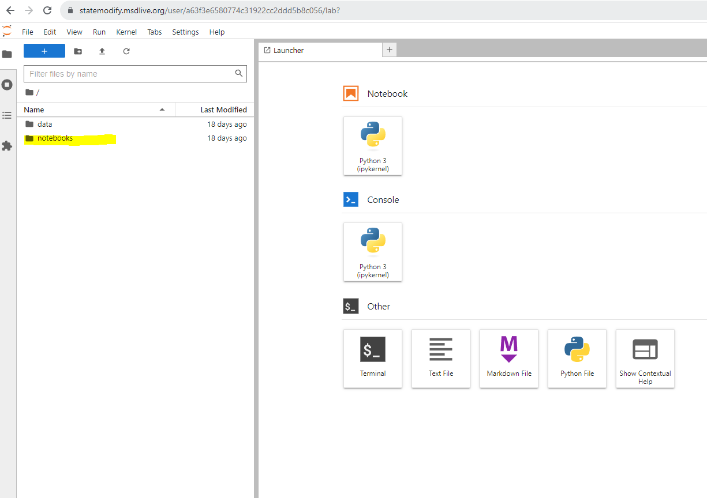
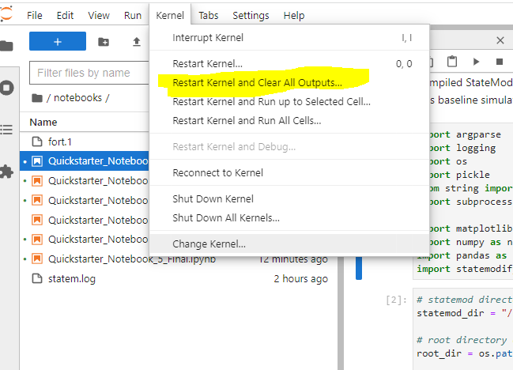

Quickstarter
==============

To demonstrate the functionality of **statemodify**, we have generated 5 notebooks that highlight how to use the functions in the package and show some very basic analyses that can be done with the output data. Each notebook demonstrates one to two **statemodify** functions for a specific West Slope basin in Colorado. The notebooks usually follow a specific form:

1. Run a baseline simulation for the basin (about 4 minutes)

2. Plot the baseline shortages for specific users or reservoir storage

3. Introduce a **statemodify** function that samples a specific uncertainty (evaporation, demand, streamflow, water rights, etc.)

4. Create a new set of input files to run through StateMod

5. Run each StateMod simulation (usually about 2 simulations, each at 4 minutes)

6. Plot the new shortages or reservoir levels with respect to the baseline values.

The notebooks are hosted in MSD-LIVE containers and can be found at: `https:/statemodify.msdlive.org <https:/statemodify.msdlive.org>`

You will be taken to a JupyterLab homepage with "data" and "notebook" buckets on the side.  The "data" directory contains all the StateMod datasets and some other template files. Click on the "notebooks" directory and choose a notebook to start. Press "shift + enter" to execute the cells in the notebook.

  Figure 1: JupyterLab home screen

IMPORTANT: When you finish a notebook and move on to another one, please restart the kernel and clear the outputs as shown below.

  Figure 1: Restarting the Kernel

The table below lists the

.. list-table:: Notebook Topics
   :widths: 25 50 50 50 50 50
   :header-rows: 1

   * - Topic
     - Notebook 1: Getting Started and using the DDM and DDR modification functions in the San Juan Subbasin
     - Notebook 2: Using the EVA modification functions in the Gunnison Subbasin
     - Notebook 3: Using the RES modification function in the Upper Colorado Subbasin
     - Notebook 4: Using the XBM and IWR modification functions across all basins
     - Notebook 5: Sampling multiple uncertainties

   * - Description
     - This notebook has more general intro information on **statemodify** and shows how changes to demand and water rights can lead to changes to user shortages in the San Juan Subbasin.
     - This notebook looks at how changes in evaporation in  reservoirs in the Gunnison subbasin lead to changes to reservoir levels
     - This notebook looks at how changes in storage in reservoirs in the Upper Colorado subbasin lead to changes to user shortages
     - This notebook debuts the stationary Hidden Markov Model to generate alternative streamflow scenarios across the basins.
     - This notebook demonstrates how to create a global Latin hypercube sample to consider multiple uncertainties in a basin.

.. include:: ../notebooks/N1_Demand_WaterRights_File_Modification.rst
.. include:: ../notebooks/N2_Evaporation_File_Modification.rst
.. include:: ../notebooks/N3_Reservoir_File_Modification.rst
.. include:: ../notebooks/N4_Streamflow_File_Modification.rst
.. include:: ../notebooks/N5_Batch_Modification.rst
