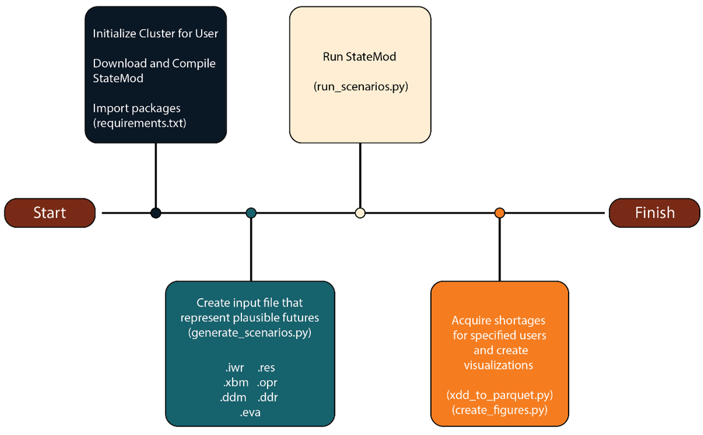

Welcome to **statemodify**!
--------------------------------

Summary
++++++++++++++++++++++++++++

The Colorado River Basin (CRB) is experiencing an unprecedented water shortage crisis brought upon by a combination of factors arising from interactions across the region’s coupled human and natural systems. Allocation of water to the seven states that rely on the Colorado River was settled in the Colorado River Compact of 1922 during a period now known to be characterized by atypically high flow (Christensen et al., 2004). Since then, aridification due to anthropogenic-driven warming has steadily reduced the overall water supply available in the basin, with a 10% decrease in the river’s flow occurring over just the past two decades (Bass et al., 2023). The river is further strained by increasing demands associated with a growing population and diverse multi-sectoral demands. Navigating these challenges also requires accounting for the complex prior appropriation water rights system governing water allocation across the region’s diverse users. 

The state of Colorado’s West Slope basins are a critical component of the Colorado River System and reflect the broader challenges faced by the entire basin. The six West Slope basins – the Upper Colorado, Yampa, White, San Juan, Dolores, and Gunnison basins – comprise the headwaters of the Colorado River and contribute over 60% of the inflow to Lake Powell in an average year (Salehabi et al., 2020). The West Slope basins represent an essential part of the State of Colorado’s economy, supporting a multibillion-dollar tourism industry, providing water for roughly 24,000 acres of irrigated farmland, and sending drinking water across the continental divide to major metropolitan areas in eastern Colorado (State of Colorado, 2023).  Uncertainty stemming from climate change and institutional response plays a dominant role in evaluations of future deliveries to Lake Powell and characterization of the basin users’ vulnerabilities (Hadjimichael et al., 2020a; Hadjimichael et al., 2020b, Salehabi et al., 2022). Recent studies estimate that changes in temperature and precipitation may result in streamflows that are between 5% and 80% lower by the end of the 21st century when compared to the historical record (Kopytkovskiy et al., 2015; Milly and Dunn, 2020; Miller et al., 2021). Institutional responses to changes in flow, such as changes to reservoir operations and water rights structures, are difficult to predict and model using traditional probabilistic methods (Hadimichael et al., 2020). This difficulty in accurately characterizing key system inputs with known probability distributions is often described as conditions of "deep uncertainty" (Lempert, 2002 ; Kwakkel et al., 2016).

To account for the deeply uncertain future conditions in the West Slope basins, approaches are needed that can help facilitate an understanding of vulnerabilities across many plausible future scenarios (Walker and Marchau, 2003; Lempert, 2002; Marchau et al., 2019). Exploratory modeling is one such approach that uses computational experiments to understand a range of possible model behaviors (Bankes, 1993). In the West Slope basins, exploratory modeling can be done with StateMod, a highly resolved, open source, regional water allocation model developed and maintained jointly by the Colorado Water Conservation Board (CWCB) and the Colorado Division of Water Resources (DWR) that is currently used to support water use assessments for the State of Colorado. The input files of StateMod can be manipulated to develop hypothetical scenarios to assess how changes in hydrology, water rights, or infrastructure impact regional water shortages, streamflow, or reservoir levels. 

StateMod is written in Fortran and conducting high-performance computing enabled ensemble exploratory modeling with it requires familiarity with Linux. Due to the model’s complexity, there are also nontrivial computational challenges in comprehensively sampling the model’s input space and managing the outputs of interest, especially for large ensembles. These challenges limit its use among researchers and broader operational users. Thus, we develop statemodify, a Python-based package and framework that allows users to easily interact with StateMod using Python exclusively. The user can implement statemodify functions to manipulate StateMod’s input files to develop alternative demand, hydrology, infrastructure, and institutional scenarios for Colorado’s West Slope basins and run these scenarios through StateMod. We also create methods to compress and extract model output into easily readable data frames and provide guidance on analysis and visualization of output in a series of Jupyter notebooks that step through the functionality of the package. 

Design and Functionality
++++++++++++++++++++++++++++

**statemodify** is a Python-based framework that provides users with a way to easily interact with StateMod in a Linux-based environment. Figure 1 illustrates a typical **statemodify** workflow along with the corresponding functions that can utilized in each step. Documentation of all functions (including helper functions that are not described here) can be found in the API linked in the left sidebar. 

Figure 1: **statemodify** workflow  

The steps of the workflow are outlined below: 

.. raw:: html

  <ol>
  <li>Develop plausible futures: Users have the option of developing plausible futures using the following functions. </li>

    <ul>

    <li><i>modify_eva( ):</i> Modifies StateMod’s <i>.eva</i> file, or net reservoir annual evaporation data file. Users can either impose a specific change to the evaporation rate or use a Latin hypercube sample to create many scenarios of evaporation rate changes (typically between -15.24 and 30.46 cm/month (-0.5 to +1 ft); Hadjimichael et al., 2020) across specific reservoirs or all larger reservoirs across the West Slope basins.</li>
    <li><i>modify_ddm( ):</i> Modifies StateMod’s <i>.ddm</i> file, or monthly water demand data file. Users can either impose a specific change to monthly demands for a list of stakeholders or use a Latin hypercube sample to multiply the current demand time series for the users by a value between 0.5 to 1.5. </li>
   <li><i>modify_ddr( ):</i> Modifies StateMod’s <i>.ddr</i> file, or water rights data file.  In this function, the user can specify a list of the IDs of the stakeholders and (1) sample from a range and apply a multiplier to how much water is decreed to a stakeholder (2) hard code in a new decree for a stakeholder or (3) adjust the rank of the stakeholder to be more or less senior. </li>
   <li><i>modify_res( ):</i> Modifies StateMod’s <i>.res</i> file, or the reservoir account data file. This file lists the accounts associated with each reservoir and the amount of water allocated to specific stakeholders. In this function, we sample losses of up to 20% of the capacity of the reservoirs (informed by Graf et al. (2010)) which can be due to erosion and sedimentation of reservoirs resulting in reduced storage. The accounts associated with the reservoirs are also reduced equally to accommodate the new storage level. Users can change the reservoir storage for a specific set of reservoirs by specifying the reservoir IDs or can decrease storage at all reservoirs in the basin.  </li>
   <li><i>modify_xbm_iwr( ):</i> Modifies StateMod’s <i>.xbm</i> (monthly streamflow) and <i>.iwr</i> (irrigation demand) data files. The <i>.xbm</i> file is overwritten with synthetic streamflow that is simultaneously generated across the outlet nodes of the five West Slope basins using a multi-basin Hidden Markov Model-based approach that effectively maintains the spatial correlation in the generated streamflow (Gold et al., in prep). A statistical disaggregation approach is used to partition aggregated flow at the outlet nodes to StateMod gauge nodes upstream (Nowak et al., 2010). The HMM-based approach is fit to observed annual streamflow but can create synthetic traces characterized by more flood and drought events (Gold et al., in prep). The irrigation demands (in the <i>.iwr</i> file) are also inherently tied to the generation of the streamflow, as irrigation demands will increase in dry years. Thus, a regression is fit across historical irrigation anomalies and historical annual flow anomalies and the appropriate irrigation anomaly is determined from this regression for every synthetically generated flow anomaly. More information on this method can be found in Hadjimichael et al. (2020).</li> 
  </ul>

  <li>
Extracting output of interest: Users can extract time series of either individual stakeholder shortages or reservoir storage levels for any simulation using the following functions:  

  <ul>

    <li><i>convert_xdd( ):</i> Stakeholder shortages resulting from a StateMod simulation are aggregated in the <i>.xdd</i> output file. Users can specify a list of stakeholder IDs to extract shortages for and results are stored in a highly compressed and columnar <i>.parquet</i> file which easily interoperates with Pandas data frames.</li>
    <li><i>extract_xre_data( ):</i> Reservoir storage resulting from a StateMod simulation is aggregated in the <i>.xre</i> output file. Users can specify the list of reservoir IDs or the name of the reservoir that storage needs to be extracted for and the resulting storage can be stored in <i>.parquet</i> or <i>.csv</i> files.</li>
  
  </ul>

  <li>
Visualizations: Within the Jupyter notebooks are examples of simple functions that can be used to visualized changes in shortages and reservoir storage relative to a historic baseline. However, within <b>statemodify</b>, there are more complex visualization functions that summarize reservoir storage across many simulations. These functions can be further adapted by the user to explore stakeholder shortages. 
 

  </ul>
  
    <li><i>plot_reservoir_boxes( ):</i> This function allows the user to create boxplots to compare the range of monthly historical reservoir storage experienced at a given reservoir vs. the range of reservoir storage that can result from synthetically generated streamflow. </li>
    <li><i>plot_res_quantiles( ):</i> This function allows the user to visualize the historical monthly distribution of reservoir levels at a given location versus the distribution that results under an array of simulated scenarios.</li>

  </ol>

Why do we need **statemodify**?
--------------------------------

Sustainable management of Colorado’s West Slope basins is necessary to support inflow into the Colorado River and, by extension, the 40 million people that depend on it for water, hydropower, agriculture, and recreation (Flavelle, 2023). Because it is unknown how the future will manifest in the West Slope, exploratory modeling with StateMod is a valuable approach to comprehensively identify the most important drivers of change and vulnerabilities to different stakeholders. Sustainable management of the region will also ultimately require combining expert knowledge across diverse groups, ranging from federal and state institutions who are prescribing larger policy and conservation efforts down to the practical knowledge acquired from individual stakeholders, many of whom have livelihoods that have been supported by the river for many generations. In an effort to better maintain StateMod and expand their user base, CWCB and DWR have developed the CDSS Open Source Initiative (OpenCDSS), which provides Java-based TSTool and StateDMI software to create and modify StateMod input files. The **statemodify** package seeks to complement and expand this toolset to accommodate large ensemble exploratory modeling and a Linux-based workflow and to provide additional options to develop more targeted file adjustments and richer streamflow scenarios. The use of Python for all **statemodify** methods as well as the ease of interacting through Jupyter notebooks can further broaden the user base that can interact with StateMod and serve as a sandbox environment for quickly testing hypotheses that a user might have without the user needing to invest large amounts of time to learn how to use StateMod and develop a workflow. Examples of such questions could be: What happens to user shortages in the Gunnison if evaporation were to change over the Blue Mesa Reservoir? If user X gains a more senior water right, does this have a bigger impact on reducing their shortages than shifts to a wetter hydroclimate? 

Though **statemodify** focuses on Colorado’s West Slope basins, this case study is representative of a broader group of institutionally complex basins that are experiencing extreme conditions due to their own regionally-specific deep uncertainties. Discovering vulnerabilities of users in these regions will likely require similar finely resolved models along with extensive computational resources. It is important to note that not every user has access to the computational resources required to do exploratory modeling. At this point in time, those users are unable to participate in this type of modeling effort. To help overcome this barrier, we demonstrate **statemodify** and the associated notebooks in containers hosted by MSD-LIVE that allow any user to conduct a small scale analysis. Users can also use the associated Dockerfiles to download and compile StateMod and run the same Jupyter notebooks on their own personal computers or high performance computing (HPC) resources. Work is currently in progress to connect statemodify with cloud platforms, such as Amazon Web Services, Microsoft Azure, and Google Cloud, which provide more accessible tiers of computing to students and researchers who don’t have access to HPC. Overall, the statemodify framework will not only broaden the user base that can interact with StateMod, but also can serve as a guide on how to make exploratory modeling accessible to diverse groups whose inclusion can lead to more robust basin management.    

References
---------------------------

Bass, B., Goldenson, N., Rahimi, S., & Hall, A. (2023). Aridification of Colorado River Basin's snowpack regions has driven water losses despite ameliorating effects of vegetation. Water Resources Research, 59(7), e2022WR033454.

Christensen, N.S., Wood, A.W., Voisin, N. et al. The Effects of Climate Change on the Hydrology and Water Resources of the Colorado River Basin. Climatic Change 62, 337–363 (2004). https://doi.org/10.1023/B:CLIM.0000013684.13621.1f

Flavelle, C. (2023, May 25). A Breakthrough Deal to Keep the Colorado River From Going Dry, for Now. The New York Times, A1. 

Gold, D.F., Gupta, R.S., Quinn, J.D, Reed P.M (2023). A Multi-site hidden Markov model to expand drought representation in the West Slope of Colorado. Journal of Water Resources Planning and Management, in prep.

Graf, W. L., Wohl, E., Sinha, T., & Sabo, J. L. (2010). Sedimentation and sustainability of western American reservoirs. Water Resources Research, 46, W12535. https://doi.org/10.1029/2009WR008836

Hadjimichael, A., Quinn, J., Wilson, E., Reed, P., Basdekas, L., Yates, D., & Garrison, M. (2020). Defining robustness, vulnerabilities, and consequential scenarios for diverse stakeholder interests in institutionally complex river basins. Earth's Future, 8(7), e2020EF001503.

Kopytkovskiy, M., Geza, M., & McCray, J. E. (2015). Climate-change impacts on water resources and hydropower potential in the Upper Colorado River Basin. Journal of Hydrology: Regional Studies, 3, 473-493.

Kwakkel, J. H., Walker, W. E., & Haasnoot, M. (2016). Coping with the wickedness of public policy problems: Approaches for decision making under deep uncertainty. Journal of Water Resources Planning and Management, 142(3), 01816001. https://doi.org/10.1061/(ASCE) WR.1943-5452.0000626

Lempert, R. J. (2002). A new decision sciences for complex systems. Proceedings of the National Academy of Sciences, (suppl 3), 7309–7313. https://doi.org/10.1073/pnas.082081699

Marchau, V. A., Walker, W. E., Bloemen, P. J., & Popper, S. W. (2019). Decision making under deep uncertainty: from theory to practice (p. 405). Springer Nature.

Miller, O. L., Miller, M. P., Longley, P. C., Alder, J. R., Bearup, L. A., Pruitt, T., ... & McKinney, T. (2021). How will baseflow respond to climate change in the upper Colorado River Basin?. Geophysical Research Letters, 48(22), e2021GL095085.

Milly, P. C., & Dunne, K. A. (2020). Colorado River flow dwindles as warming-driven loss of reflective snow energizes evaporation. Science, 367(6483), 1252-1255.

Nowak, K., Prairie, J., Rajagopalan, B., & Lall, U. (2010). A nonparametric stochastic approach for multisite disaggregation of annual to daily streamflow. Water resources research, 46(8).

Salehabadi, H., Tarboton, D., Kuhn, E., Udall, B., Wheeler, K., Rosenberg, D., ... & Schmidt, J. C. (2020). The future hydrology of the Colorado River Basin. The Future of the Colorado River Project.
State of Colorado (2023). Colorado's water plan. Denver, Colorado.

Walker,W. E., & Marchau, V. A. W. J. (2003). Dealing with uncertainty in policy analysis and policymaking. Integrated Assessment, 4(1),1–4. https://doi.org/10.1076/iaij.4.1.1.16462

Documentation
--------------------------

.. toctree::
   :maxdepth: 1
   :caption: Getting Started

   getting-started/installation
   getting-started/quickstarter
   getting-started/useful_links

.. toctree::
   :maxdepth: 1
   :caption: Python API

   reference/api

.. toctree::
   :maxdepth: 1
   :caption: Contributing

   reference/contributing
