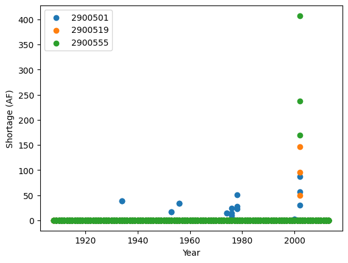
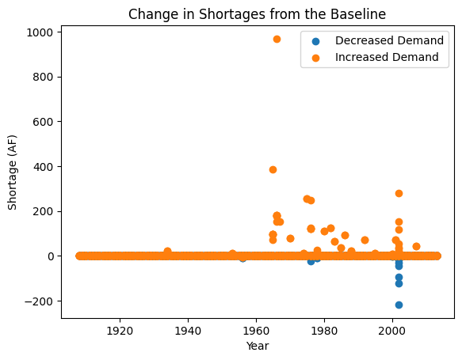

``statemodify`` Quickstarter Notebook #1: Getting Started and Using the DDM and DDR Modification Functions in the San Juan River Basin
--------------------------------------------------------------------------------------------------------------------------------------

In this series of five notebooks, we demonstrate the functionality of
``statemodify`` using three of the five subbasins on the West Slope
basin in the state of Colorado: Gunnison, San Juan/Dolores, and the
Upper Colorado Basin. There are two classes of adjustments offered in
``statemodify`` that can be used to create alternative future states of
the world for the region:

1. Application of multipliers or additives to the original dataset which
   are sampled from specified bounds using a Latin hypercube sample

2. Complete swap of input data with data generated from an external
   method

Option 1 is applicable to ``.ddm`` (monthly demand), ``.ddr`` (water
rights), ``.eva`` (reservoir evaporation), ``.res`` (reservoir storage).

Option 2 is applicable to ``.xbm`` (monthly streamflow) and ``.iwr``
(irrigation demand). In ``statemodify`` we provide a Hidden Markov Model
(HMM)-based approach to generate synthetic flows across the basins and
tie in irrigation demand to be negatively correlated to increased
streamflow.

In this first notebook, we will demonstrate now to use the demand
(``modify_ddm()``)and water rights (``modify_ddr()``) modification
functions in the San Juan River Basin. Demands are projected to increase
with the growth of cities and agriculture and water rights will likely
change as discussions on changes to the Colorado Compact and
re-allocation of water across the Colorado River Basin to promote
sustainable development continue.

.. container:: alert alert-block alert-warning

   Tip: When each StateMod file is mentioned, clicking on the name will
   link the user to the StateMod documentation with more information on
   that file.

Step 1: Run a Historical Simulation in StateMod for the San Juan Basin
~~~~~~~~~~~~~~~~~~~~~~~~~~~~~~~~~~~~~~~~~~~~~~~~~~~~~~~~~~~~~~~~~~~~~~

Before we start on an exploratory modeling journey, you may be first
interested in understanding water shortages that the basin has
historically experienced. In the container, we have downloaded and
compiled StateMod, ``statemodify``, and the San Juan dataset from the
Colorado’s Decision Support System (CDSS) website. We can run a baseline
simulation below which takes approximately 4 minutes. In this baseline
simulation, we run StateMod over the length of the historical period
(105 years) under the assumption that we are starting from current
conditions.

.. code:: ipython3

    import argparse
    import logging
    import os
    import pickle
    from string import Template
    import subprocess

    import matplotlib.pyplot as plt
    import numpy as np
    import pandas as pd
    import statemodify as stm

.. container:: alert alert-block alert-info

   NOTE: Each simulation in this notebook is run for the length of the
   historical period (from 1909-2013). If you want to reduce the length
   of the simulation, navigate to the ``.ctl`` file and adjust the
   ``iystr`` and ``iyend`` variables. For this notebook, these files are
   located in:
   ``data/sj2015_StateMod_modified/sj2015_StateMod_modified/StateMod Notebook/sj2015.ctl``
   and
   ``data/gm2015_StateMod_modified/gm2015_StateMod_modified/StateMod/gm2015.ctl``

.. code:: ipython3

    # statemod directory
    statemod_dir = "/usr/src/statemodify/statemod_gunnison_sjd"

    # root directory of statemod data for the target basin
    root_dir = os.path.join(statemod_dir, "src", "main", "fortran")

    # home directory of notebook instance
    home_dir = os.path.dirname(os.getcwd())

    # path to the statemod executable
    statemod_exe = os.path.join(root_dir, "statemod-17.0.3-gfortran-lin-64bit-o3")

    # data directory and root name for the target basin
    data_dir = os.path.join(
        home_dir,
        "data",
        "sj2015_StateMod_modified",
        "sj2015_StateMod_modified",
        "StateMod"
    )

    # directory to the target basin input files with root name for the basin
    basin_path = os.path.join(data_dir, "sj2015B")

    # scenarios output directory
    scenarios_dir_ddm = os.path.join(data_dir, "scenarios_ddm")
    scenarios_dir_ddr = os.path.join(data_dir, "scenarios_ddr")

    # parquet files output directory
    parquet_dir_ddm = os.path.join(data_dir, "parquet_ddm")
    parquet_dir_ddr = os.path.join(data_dir, "parquet_ddr")

    # path to ddm and ddr template file
    ddm_template_file = os.path.join(
        home_dir,
        "data",
        "sj2015B_template_ddm.rsp"
    )

    ddr_template_file = os.path.join(
        home_dir,
        "data",
        "sj2015B_template_ddr.rsp"
    )

.. code:: ipython3

    # run statemod
    subprocess.call([statemod_exe, basin_path, "-simulate"])


.. parsed-literal::

     Startup log file for messages to this point: /home/jovyan/data/sj2015_StateMod_modified/sj2015_StateMod_modified/StateMod/sj2015B.rsp
       Closing startup log file: statem.log
       Opening dataset log file: /home/jovyan/data/sj2015_StateMod_modified/sj2015_StateMod_modified/StateMod/sj2015B.log
    ________________________________________________________________________

            StateMod
            State of Colorado - Water Supply Planning Model

            Version:     17.0.3
            Last revision date: 2021/09/12

    ________________________________________________________________________

      Subroutine Execut
      Subroutine Datinp

    ...

    ________________________________________________________________________
      Execut; Successful Termination
      Statem; See detailed messages in dataset log file: /home/jovyan/data/sj2015_StateMod_modified/sj2015_StateMod_modified/StateMod/sj2015B.log
     Stop 0

Once StateMod has run successfully, we can now extract user shortages
from the
```.xdd`` <https://opencdss.state.co.us/statemod/latest/doc-user/OutputDescription/521/>`__
output file using the ``statemodify`` output modification function
``convert_xdd()``. We denote a list of user IDs
(‘2900501’,‘2900519’,‘2900555’) who we want to extract shortages for and
then these shortages are saved in a compressed Parquet file format that
can then be read in as a Pandas dataframe in Python. We can also remove
the larger output files once the requested shortages have been extracted
and saved.

.. code:: ipython3

    #Extract shortages using statemodify convert_xdd() function

    # create a directory to store the historical shortages
    output_dir = os.path.join(data_dir, "historic_shortages")

    # create a directory to store the new files in if it does not exist
    output_directory = os.path.join(data_dir, "historic_shortages")
    if not os.path.exists(output_directory):
        os.makedirs(output_directory)

    stm.xdd.convert_xdd(
        # path to a directory where output .parquet files should be written
        output_path=output_dir,
        # whether to abort if .parquet files already exist at the output_path
        allow_overwrite=True,
        # path, glob, or a list of paths/globs to the .xdd files you want to convert
        xdd_files=os.path.join(data_dir, "*.xdd"),
        # if the output .parquet files should only contain a subset of structure ids, list them here; None for all
        id_subset=['2900501','2900519','2900555'],
        # how many .xdd files to convert in parallel; optimally you will want 2-4 CPUs per parallel process
        parallel_jobs=4,
        # convert to natural data types
        preserve_string_dtype=False
    )


.. parsed-literal::

    100%|██████████| 1/1 [00:00<00:00, 29.32it/s]


.. code:: ipython3

    data=pd.read_parquet(os.path.join(output_dir,'sj2015B.parquet'),engine='pyarrow')
    data


.. raw:: html

    <div>
    <style scoped>
        .dataframe tbody tr th:only-of-type {
            vertical-align: middle;
        }

        .dataframe tbody tr th {
            vertical-align: top;
        }

        .dataframe thead th {
            text-align: right;
        }
    </style>
    <table border="1" class="dataframe">
      <thead>
        <tr style="text-align: right;">
          <th></th>
          <th>structure_name</th>
          <th>structure_id</th>
          <th>river_id</th>
          <th>year</th>
          <th>month</th>
          <th>demand_total</th>
          <th>demand_cu</th>
          <th>from_river_by_priority</th>
          <th>from_river_by_storage</th>
          <th>from_river_by_other</th>
          <th>...</th>
          <th>station_in_out_return_flow</th>
          <th>station_in_out_well_deplete</th>
          <th>station_in_out_from_to_groundwater_storage</th>
          <th>station_balance_river_inflow</th>
          <th>station_balance_river_divert</th>
          <th>station_balance_river_by_well</th>
          <th>station_balance_river_outflow</th>
          <th>available_flow</th>
          <th>control_location</th>
          <th>control_right</th>
        </tr>
      </thead>
      <tbody>
        <tr>
          <th>15015</th>
          <td>ALLEN CREEK DITCH</td>
          <td>2900501</td>
          <td>2900501</td>
          <td>1908</td>
          <td>OCT</td>
          <td>13.0</td>
          <td>7.0</td>
          <td>13.0</td>
          <td>0.0</td>
          <td>0.0</td>
          <td>...</td>
          <td>0.0</td>
          <td>0.0</td>
          <td>0.0</td>
          <td>3792.0</td>
          <td>13.0</td>
          <td>0.0</td>
          <td>3779.0</td>
          <td>2918.0</td>
          <td>NA</td>
          <td>-1.0</td>
        </tr>
        <tr>
          <th>15016</th>
          <td>ALLEN CREEK DITCH</td>
          <td>2900501</td>
          <td>2900501</td>
          <td>1908</td>
          <td>NOV</td>
          <td>0.0</td>
          <td>0.0</td>
          <td>0.0</td>
          <td>0.0</td>
          <td>0.0</td>
          <td>...</td>
          <td>0.0</td>
          <td>0.0</td>
          <td>0.0</td>
          <td>2343.0</td>
          <td>0.0</td>
          <td>0.0</td>
          <td>2343.0</td>
          <td>1510.0</td>
          <td>NA</td>
          <td>-1.0</td>
        </tr>
        <tr>
          <th>15017</th>
          <td>ALLEN CREEK DITCH</td>
          <td>2900501</td>
          <td>2900501</td>
          <td>1908</td>
          <td>DEC</td>
          <td>0.0</td>
          <td>0.0</td>
          <td>0.0</td>
          <td>0.0</td>
          <td>0.0</td>
          <td>...</td>
          <td>0.0</td>
          <td>0.0</td>
          <td>0.0</td>
          <td>1721.0</td>
          <td>0.0</td>
          <td>0.0</td>
          <td>1721.0</td>
          <td>860.0</td>
          <td>NA</td>
          <td>-1.0</td>
        </tr>
        <tr>
          <th>15018</th>
          <td>ALLEN CREEK DITCH</td>
          <td>2900501</td>
          <td>2900501</td>
          <td>1909</td>
          <td>JAN</td>
          <td>0.0</td>
          <td>0.0</td>
          <td>0.0</td>
          <td>0.0</td>
          <td>0.0</td>
          <td>...</td>
          <td>0.0</td>
          <td>0.0</td>
          <td>0.0</td>
          <td>1512.0</td>
          <td>0.0</td>
          <td>0.0</td>
          <td>1512.0</td>
          <td>525.0</td>
          <td>NA</td>
          <td>-1.0</td>
        </tr>
        <tr>
          <th>15019</th>
          <td>ALLEN CREEK DITCH</td>
          <td>2900501</td>
          <td>2900501</td>
          <td>1909</td>
          <td>FEB</td>
          <td>0.0</td>
          <td>0.0</td>
          <td>0.0</td>
          <td>0.0</td>
          <td>0.0</td>
          <td>...</td>
          <td>0.0</td>
          <td>0.0</td>
          <td>0.0</td>
          <td>1370.0</td>
          <td>0.0</td>
          <td>0.0</td>
          <td>1370.0</td>
          <td>510.0</td>
          <td>NA</td>
          <td>-1.0</td>
        </tr>
        <tr>
          <th>...</th>
          <td>...</td>
          <td>...</td>
          <td>...</td>
          <td>...</td>
          <td>...</td>
          <td>...</td>
          <td>...</td>
          <td>...</td>
          <td>...</td>
          <td>...</td>
          <td>...</td>
          <td>...</td>
          <td>...</td>
          <td>...</td>
          <td>...</td>
          <td>...</td>
          <td>...</td>
          <td>...</td>
          <td>...</td>
          <td>...</td>
          <td>...</td>
        </tr>
        <tr>
          <th>118750</th>
          <td>CARR DITCH</td>
          <td>2900555</td>
          <td>2900555</td>
          <td>2013</td>
          <td>JUN</td>
          <td>426.0</td>
          <td>81.0</td>
          <td>426.0</td>
          <td>0.0</td>
          <td>0.0</td>
          <td>...</td>
          <td>711.0</td>
          <td>0.0</td>
          <td>0.0</td>
          <td>29239.0</td>
          <td>426.0</td>
          <td>0.0</td>
          <td>28813.0</td>
          <td>26410.0</td>
          <td>NA</td>
          <td>-1.0</td>
        </tr>
        <tr>
          <th>118751</th>
          <td>CARR DITCH</td>
          <td>2900555</td>
          <td>2900555</td>
          <td>2013</td>
          <td>JUL</td>
          <td>314.0</td>
          <td>88.0</td>
          <td>314.0</td>
          <td>0.0</td>
          <td>0.0</td>
          <td>...</td>
          <td>581.0</td>
          <td>0.0</td>
          <td>0.0</td>
          <td>9580.0</td>
          <td>314.0</td>
          <td>0.0</td>
          <td>9266.0</td>
          <td>7180.0</td>
          <td>NA</td>
          <td>-1.0</td>
        </tr>
        <tr>
          <th>118752</th>
          <td>CARR DITCH</td>
          <td>2900555</td>
          <td>2900555</td>
          <td>2013</td>
          <td>AUG</td>
          <td>203.0</td>
          <td>59.0</td>
          <td>203.0</td>
          <td>0.0</td>
          <td>0.0</td>
          <td>...</td>
          <td>524.0</td>
          <td>0.0</td>
          <td>0.0</td>
          <td>20441.0</td>
          <td>203.0</td>
          <td>0.0</td>
          <td>20238.0</td>
          <td>18989.0</td>
          <td>NA</td>
          <td>-1.0</td>
        </tr>
        <tr>
          <th>118753</th>
          <td>CARR DITCH</td>
          <td>2900555</td>
          <td>2900555</td>
          <td>2013</td>
          <td>SEP</td>
          <td>144.0</td>
          <td>39.0</td>
          <td>144.0</td>
          <td>0.0</td>
          <td>0.0</td>
          <td>...</td>
          <td>454.0</td>
          <td>0.0</td>
          <td>0.0</td>
          <td>42214.0</td>
          <td>144.0</td>
          <td>0.0</td>
          <td>42070.0</td>
          <td>41359.0</td>
          <td>NA</td>
          <td>-1.0</td>
        </tr>
        <tr>
          <th>118754</th>
          <td>CARR DITCH</td>
          <td>2900555</td>
          <td>2900555</td>
          <td>2013</td>
          <td>TOT</td>
          <td>1341.0</td>
          <td>328.0</td>
          <td>1341.0</td>
          <td>0.0</td>
          <td>0.0</td>
          <td>...</td>
          <td>3395.0</td>
          <td>0.0</td>
          <td>0.0</td>
          <td>228506.0</td>
          <td>1341.0</td>
          <td>0.0</td>
          <td>227165.0</td>
          <td>215605.0</td>
          <td>NA</td>
          <td>-1.0</td>
        </tr>
      </tbody>
    </table>
    <p>4095 rows × 36 columns</p>
    </div>


Upon inspecting the Parquet file above, we see the contents of the
``.xdd`` file, including the shortages experienced by the structures
that we specified for the length of the historical period.

We can then take these shortages and plot them for our list of users.

.. code:: ipython3

    fig, ax = plt.subplots()

    for name, group in data.groupby('structure_id'):
        ax.scatter(
            group['year'], group['shortage_total'], label=name)

    plt.xlabel("Year")
    plt.ylabel("Shortage (AF)")
    plt.legend()


.. parsed-literal::

    <matplotlib.legend.Legend at 0x7f17d8d6ea70>





You can look up the names and rights of the users listed above in the
``sj2015.ddr`` file (found at
``data/sj2015_StateMod_modified/sj2015_StateMod_modified/StateMod/sj2015.ddr``).
Here, a higher Admin # denotes lower seniority. You’ll see that the
users chosen here have junior to medium seniority of water rights with
varying amounts of water decreed to them. The figure above shows that
all users have experienced shortages. User 2900501 has experienced the
most frequent shortages respectively, likely due in part to their less
senior water right. Generally, we see a higher magnitude of shortages
for all users during the 2002 drought.

Step 2a: Modify StateMod Input Files for Exploratory Analyses- Demand Function Example
~~~~~~~~~~~~~~~~~~~~~~~~~~~~~~~~~~~~~~~~~~~~~~~~~~~~~~~~~~~~~~~~~~~~~~~~~~~~~~~~~~~~~~

Now that we’ve run StateMod in baseline mode, the next step shows how we
can run it in an exploratory analysis mode. To do this, we need to
create some plausible futures and adjust the input files of StateMod to
reflect these changes. In this step, we’ll demonstrate Option 1 for
statemodify adjustments using the
```.ddm`` <https://opencdss.state.co.us/statemod/latest/doc-user/InputDescription/417/>`__
file as an example, which involves multiplying the current demand time
series for these users by a value in between 0.5 to 1.5. Here we specify
the IDs of the users and the bounds from which we want to sample
multipliers for the demand. We create 2 alternative states of the world
(SOW) using a Latin hypercube sampling (LHS) procedure and store them in
the ``input_files`` directory.

.. code:: ipython3

    # a dictionary to describe what users you want to modify and the bounds for the LHS
    setup_dict = {
        "ids": ["2900501", "2900519","2900555"],
        "bounds": [0.5, 1.5]
    }

    output_directory = output_dir = os.path.join(data_dir, "input_files")

    scenario = "1"

    # the number of samples you wish to generate
    n_samples = 2

    # seed value for reproducibility if so desired
    seed_value = 1

    # number of rows to skip in file after comment
    skip_rows = 1

    # name of field to query
    query_field = "id"

    # number of jobs to launch in parallel; -1 is all but 1 processor used
    n_jobs = -1

    # basin to process
    basin_name = "San_Juan"

    # generate a batch of files using generated LHS
    stm.modify_ddm(
        modify_dict=setup_dict,
        query_field=query_field,
        output_dir=output_directory,
        scenario=scenario,
        basin_name=basin_name,
        sampling_method="LHS",
        n_samples=n_samples,
        skip_rows=skip_rows,
        n_jobs=n_jobs,
        seed_value=seed_value,
        template_file=None,
        factor_method="multiply",
        data_specification_file=None,
        min_bound_value=-0.5,
        max_bound_value=1.5,
        save_sample=True
    )


It’s helpful to set ``save_sample=True`` to see the values of the
multipliers that we are creating. We see below that in our 1st SOW, we
are reducing demand for our users by 30% and then in our 2nd SOW, we are
increasing demand for our users by 36%.

.. code:: ipython3

    sample_array = np.load(output_directory+'/ddm_2-samples_scenario-1.npy')
    sample_array


.. parsed-literal::

    array([[0.708511  ],
           [1.36016225]])


Step 2b: Read in the New Input Files and Run StateMod : Demand Function Example
~~~~~~~~~~~~~~~~~~~~~~~~~~~~~~~~~~~~~~~~~~~~~~~~~~~~~~~~~~~~~~~~~~~~~~~~~~~~~~~

Now that we have created the input files, the next step is to run
StateMod with the new input files. The file that StateMod uses to
configure a simulation is called a
```.rsp`` <https://opencdss.state.co.us/statemod/latest/doc-user/InputDescription/41/>`__
file. For this dataset, the configuration file is ``sj2015B.rsp``. This
file contains the paths of all of the supporting files that StateMod
needs to run. We create a template .rsp file
(``sj2015B_template_ddm.rsp``) and swap in the path to the two new
alternative ``.ddm`` files that are created. Then we run StateMod for
the two scenarios and store the shortages in Parquet file format. Each
scenario will take approximately 4 minutes.

.. code:: ipython3

    # set realization and sample
    realization = 1
    sample = np.arange(0, 2, 1)

    # read RSP template
    with open(ddm_template_file) as template_obj:

        # read in file
        template_rsp = Template(template_obj.read())

        for i in sample:

            # create scenario name
            scenario = f"S{i}_{realization}"

            # dictionary holding search keys and replacement values to update the template file
            d = {"DDM": f"../../input_files/sj2015B_{scenario}.ddm"}

            # update the template
            new_rsp = template_rsp.safe_substitute(d)

            # construct simulated scenario directory
            simulated_scenario_dir = os.path.join(scenarios_dir_ddm, scenario)
            if not os.path.exists(simulated_scenario_dir):
                os.makedirs(simulated_scenario_dir)

            # target rsp file
            rsp_file = os.path.join(simulated_scenario_dir, f"sj2015B_{scenario}.rsp")

            # write updated rsp file
            with open(rsp_file, "w") as f1:
                f1.write(new_rsp)

            # construct simulated basin path
            simulated_basin_path = os.path.join(simulated_scenario_dir, f"sj2015B_{scenario}")

            # run StateMod
            print(f"Running: {scenario}")
            os.chdir(simulated_scenario_dir)

            subprocess.call([statemod_exe, simulated_basin_path, "-simulate"])

            #Save output to parquet files
            print('creating parquet for ' + scenario)

            output_directory = os.path.join(parquet_dir_ddm+"/scenario/"+ scenario)

            if not os.path.exists(output_directory):
                os.makedirs(output_directory)

            stm.xdd.convert_xdd(
                output_path=output_directory,
                allow_overwrite=False,
                xdd_files=scenarios_dir_ddm + "/"+ scenario + "/sj2015B_"+scenario+".xdd",
                id_subset=['2900501','2900519','2900555'],
                parallel_jobs=4,
                preserve_string_dtype=False
            )


.. parsed-literal::

    Running: S0_1
     Startup log file for messages to this point: /home/jovyan/data/sj2015_StateMod_modified/sj2015_StateMod_modified/StateMod/scenarios_ddm/S0_1/sj2015B_S0_1.rsp
       Closing startup log file: statem.log
       Opening dataset log file: /home/jovyan/data/sj2015_StateMod_modified/sj2015_StateMod_modified/StateMod/scenarios_ddm/S0_1/sj2015B_S0_1.log
    ________________________________________________________________________

            StateMod
            State of Colorado - Water Supply Planning Model

            Version:     17.0.3
            Last revision date: 2021/09/12

    ________________________________________________________________________

      Subroutine Execut
      Subroutine Datinp

    ...

    ________________________________________________________________________
      Execut; Successful Termination
      Statem; See detailed messages in dataset log file: /home/jovyan/data/sj2015_StateMod_modified/sj2015_StateMod_modified/StateMod/scenarios_ddm/S0_1/sj2015B_S0_1.log
     Stop 0
    creating parquet for S0_1


Step 2c: Visualize Shortages in New SOWs- Demand Function Example
~~~~~~~~~~~~~~~~~~~~~~~~~~~~~~~~~~~~~~~~~~~~~~~~~~~~~~~~~~~~~~~~~

Now that we have run our simulations, we can visualize the difference in
shortages experienced by the stakeholders in our two SOWs. Let’s focus
on the user: 2900501, a junior user who experienced the most frequent
shortages historically across the stakeholders we looked at. Let’s look
back at the LHS sample and see that SOW 1 is where we have a decreased
demand (0.7 multiplier) and SOW 2 is where we have an increased demand
(1.4 multiplier).

.. code:: ipython3

    output_directory = os.path.join(data_dir, "input_files")
    sample_array = np.load(output_directory+'/ddm_2-samples_scenario-1.npy')
    sample_array


.. parsed-literal::

    array([[0.708511  ],
           [1.36016225]])


Now we can define shortages in the alternative states of the world with
respect to the shortages received in the baseline case.

.. code:: ipython3

    # Read in raw parquet files
    baseline=pd.read_parquet(data_dir+'/historic_shortages/sj2015B.parquet',engine='pyarrow')
    SOW_1=pd.read_parquet(parquet_dir_ddm+'/scenario/S0_1/sj2015B_S0_1.parquet',engine='pyarrow')
    SOW_2=pd.read_parquet(parquet_dir_ddm+'/scenario/S1_1/sj2015B_S1_1.parquet',engine='pyarrow')

    # Subtract shortages with respect to the baseline
    subset_df=pd.concat([baseline['year'],baseline['shortage_total'],SOW_1['shortage_total'],SOW_2['shortage_total']],axis=1)
    subset_df = subset_df.set_axis(['Year', 'Baseline', 'SOW_1','SOW_2'], axis=1)
    subset_df['SOW_1_diff'] = subset_df['SOW_1']-subset_df['Baseline']
    subset_df['SOW_2_diff'] = subset_df['SOW_2']-subset_df['Baseline']

    # Plot shortages
    fig, ax = plt.subplots()

    ax.scatter(subset_df['Year'], subset_df['SOW_1_diff'],label='Decreased Demand')
    ax.scatter(subset_df['Year'], subset_df['SOW_2_diff'],label='Increased Demand')

    plt.xlabel("Year")
    plt.ylabel("Shortage (AF)")
    plt.title("Change in Shortages from the Baseline")
    plt.legend()


.. parsed-literal::

    <matplotlib.legend.Legend at 0x7fd2d4fcae90>





As expected, we see that an increase in demand typically causes an
increase in shortage magnitude and frequency whereas the reduction in
demand leads to the opposite. This finishes our simple example to
demonstrate how adjustments to demand might change the shortages
experienced by a user.

Step 3a: Modify StateMod Input Files for Exploratory Analyses- Water Rights Function Example
~~~~~~~~~~~~~~~~~~~~~~~~~~~~~~~~~~~~~~~~~~~~~~~~~~~~~~~~~~~~~~~~~~~~~~~~~~~~~~~~~~~~~~~~~~~~

Following from Step 2, we can run the same analysis for the function
that manipulates the ``sj2015.ddr`` file, which corresponds to users
water rights. In this function, we can specify the IDs of the users and
can can utilize a variety of options for how we want to change the
```.ddr`` <https://opencdss.state.co.us/statemod/latest/doc-user/InputDescription/46/>`__
file. We can either sample from some bounds that apply multipliers to
the decree, hard code in values for the decree, or adjust the rank of
the user. In this simple example, we take a very junior user, ID:
2900501, and make them have the highest water right by changing their
rank to 1.

.. code:: ipython3

    # a dictionary to describe what you want to modify and the bounds for the LHS
    setup_dict = {
        # ids can either be 'struct' or 'id' values
        "ids": ["2900501"],

        # turn id on or off completely or for a given period
        # if 0 = off, 1 = on, YYYY = on for years >= YYYY, -YYYY = off for years > YYYY; see file header
        "on_off": [1],

        # apply rank of administrative order where 0 is lowest (senior) and n is highest (junior); None is no change
        "admin": [1],
    }

    output_directory = os.path.join(data_dir, "input_files")
    scenario = "1"

    # the number of samples you wish to generate
    n_samples = 1

    # seed value for reproducibility if so desired
    seed_value = 1

    # number of rows to skip in file after comment
    skip_rows = 0

    # name of field to query
    query_field = "struct"

    # number of jobs to launch in parallel; -1 is all but 1 processor used
    n_jobs = -1

    # basin to process
    basin_name = "San_Juan"

    # generate a batch of files using generated LHS
    stm.modify_ddr(
        modify_dict=setup_dict,
        query_field=query_field,
        output_dir=output_directory,
        scenario=scenario,
        basin_name=basin_name,
        sampling_method="LHS",
        n_samples=n_samples,
        skip_rows=skip_rows,
        n_jobs=n_jobs,
        seed_value=seed_value,
        template_file=None,
        factor_method="multiply",
        data_specification_file=None,
        min_bound_value=-0.5,
        max_bound_value=1.5,
        save_sample=True
    )


In the ``input_files`` directory, you can open the ``sj2015B_S0_1.ddr``
file and see that the Admin # of our selected user has now become
1.0000. Now we rerun our code to do the StateMod simulation, this time
using the .\ ``ddr`` template file.

.. code:: ipython3

    # set realization and sample
    realization = 1
    sample = np.arange(0, 1, 1)

    # read RSP template
    with open(ddr_template_file) as template_obj:

        # read in file
        template_rsp = Template(template_obj.read())

        for i in sample:

            # create scenario name
            scenario = f"S{i}_{realization}"

            # dictionary holding search keys and replacement values to update the template file
            d = {"DDR": f"../../input_files/sj2015B_{scenario}.ddr"}

            # update the template
            new_rsp = template_rsp.safe_substitute(d)

            # construct simulated scenario directory
            simulated_scenario_dir = os.path.join(scenarios_dir_ddr, scenario)
            if not os.path.exists(simulated_scenario_dir):
                os.makedirs(simulated_scenario_dir)

            # target rsp file
            rsp_file = os.path.join(simulated_scenario_dir, f"sj2015B_{scenario}.rsp")

            # write updated rsp file
            with open(rsp_file, "w") as f1:
                f1.write(new_rsp)

            # construct simulated basin path
            simulated_basin_path = os.path.join(simulated_scenario_dir, f"sj2015B_{scenario}")

            # run StateMod
            print(f"Running: {scenario}")
            os.chdir(simulated_scenario_dir)

            subprocess.call([statemod_exe, simulated_basin_path, "-simulate"])

            #Save output to parquet files
            print('creating parquet for ' + scenario)

            output_directory = os.path.join(parquet_dir_ddr+"/scenario/"+ scenario)

            if not os.path.exists(output_directory):
                os.makedirs(output_directory)

            stm.xdd.convert_xdd(
                output_path=output_directory,
                allow_overwrite=False,
                xdd_files=scenarios_dir_ddr + "/"+ scenario + "/sj2015B_"+scenario+".xdd",
                id_subset=['2900501'],
                parallel_jobs=2,
                preserve_string_dtype=False
            )


.. parsed-literal::

    Running: S0_1
     Startup log file for messages to this point: /home/jovyan/data/sj2015_StateMod_modified/sj2015_StateMod_modified/StateMod/scenarios_ddr/S0_1/sj2015B_S0_1.rsp
       Closing startup log file: statem.log
       Opening dataset log file: /home/jovyan/data/sj2015_StateMod_modified/sj2015_StateMod_modified/StateMod/scenarios_ddr/S0_1/sj2015B_S0_1.log
    ________________________________________________________________________

            StateMod
            State of Colorado - Water Supply Planning Model

            Version:     17.0.3
            Last revision date: 2021/09/12

    ________________________________________________________________________

      Subroutine Execut
      Subroutine Datinp

    ...

    ________________________________________________________________________
      Execut; Successful Termination
      Statem; See detailed messages in dataset log file: /home/jovyan/data/sj2015_StateMod_modified/sj2015_StateMod_modified/StateMod/scenarios_ddr/S0_1/sj2015B_S0_1.log
     Stop 0
    creating parquet for S0_1


As before, let’s go ahead and plot the shortages for our User 2900501
with respect to the baseline shortages.

.. code:: ipython3

    # Read in raw parquet files
    baseline=pd.read_parquet(data_dir+'/historic_shortages/sj2015B.parquet',engine='pyarrow')
    SOW_1=pd.read_parquet(parquet_dir_ddr+ '/scenario/S0_1/sj2015B_S0_1.parquet',engine='pyarrow')

    # Subtract shortages with respect to the baseline
    subset_df=pd.concat([baseline['year'],baseline['shortage_total'],SOW_1['shortage_total']],axis=1)
    subset_df = subset_df.set_axis(['Year', 'Baseline', 'SOW_1'], axis=1)
    subset_df['diff']=subset_df['SOW_1']-subset_df['Baseline']

    # Plot shortages
    fig, ax = plt.subplots()

    ax.scatter(subset_df['Year'], subset_df['diff'])

    plt.xlabel("Year")
    plt.ylabel("Shortage (AF)")
    plt.title("Change in Shortages from the Baseline")


.. parsed-literal::

    Text(0.5, 1.0, 'Change in Shortages from the Baseline')


.. image:: ../notebooks/output_37_1.png


We generally see the behavior we expect to see which is that with more
senior water rights, the user sees a decrease in shortage magnitude.

Now, continue on to Quickstarter Notebook #2 to learn how to use the
reservoir evaporation modification fuction.

.. container:: alert alert-block alert-warning

   Tip: If you are interested in understanding how to apply
   ``statemodify`` functions to your own model, take a look at the
   source code found in the repository here:

   .. container::

      ::

         1.  <a href="https://github.com/IMMM-SFA/statemodify/blob/main/statemodify/ddm.py">modify_ddm()</a>

   .. container::

      ::

         2.  <a href="https://github.com/IMMM-SFA/statemodify/blob/main/statemodify/ddr.py">modify_ddr()</a>
