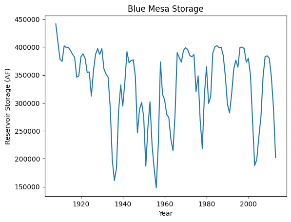
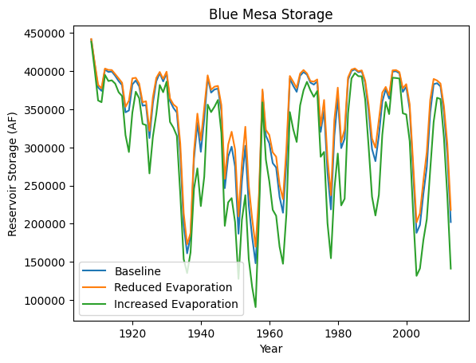

``statemodify`` Quickstarter Notebook #2 : Using the EVA Modification Function in the Gunnison River Basin
----------------------------------------------------------------------------------------------------------

This notebook demonstrates the reservoir evaporation modification
function using the Gunnison River Basin as an example. Reservoir
evaporation is a pressing concern in the CRB. Lake Powell loses 0.86
million acre/ft per year to evaporation, which is over 6% of the flow
into the Colorado River and nearly the allocation to the state of Utah.
With warming temperatures driving aridification in the region,
evaporation will play an increasingly important role in shortages to
users.

Step 1: Run a Historical Simulation in StateMod for the Gunnison Subbasin
~~~~~~~~~~~~~~~~~~~~~~~~~~~~~~~~~~~~~~~~~~~~~~~~~~~~~~~~~~~~~~~~~~~~~~~~~

To explore the importance of evaporation, we first we run baseline
simulation as we did in the first notebook, but this time, using the
dataset for the Gunnison.

.. code:: ipython3

    import argparse
    import logging
    import os
    import pickle
    from string import Template
    import subprocess
    
    import matplotlib.pyplot as plt
    import numpy as np
    import pandas as pd 
    import statemodify as stm

.. container:: alert alert-block alert-info

   NOTE: Each simulation in this notebook is run for the length of the
   historical period (from 1909-2013). If you want to reduce the length
   of the simulation, navigate to the ``.ctl`` file and adjust the
   ``iystr`` and ``iyend`` variables. For this notebook, this file is
   located in:
   ``data/gm2015_StateMod_modified/gm2015_StateMod_modified/StateMod/gm2015.ctl``

.. code:: ipython3

    # statemod directory
    statemod_dir = "/usr/src/statemodify/statemod_gunnison_sjd"
    
    # root directory of statemod data for the target basin
    root_dir = os.path.join(statemod_dir, "src", "main", "fortran")
    
    # home directory of notebook instance
    home_dir = os.path.dirname(os.getcwd())
    
    # path to the statemod executable
    statemod_exe = os.path.join(root_dir, "statemod-17.0.3-gfortran-lin-64bit-o3")
    
    # data directory and root name for the target basin
    data_dir = os.path.join(
        home_dir,
        "data",
        "gm2015_StateMod_modified",
        "gm2015_StateMod_modified",
        "StateMod"
    )
    
    # directory to the target basin input files with root name for the basin
    basin_path = os.path.join(data_dir, "gm2015B")
    
    # scenarios output directory
    scenarios_dir = os.path.join(data_dir, "scenarios")
    
    # path to eva template file
    eva_template_file = os.path.join(
        home_dir,
        "data",
        "gm2015B_template_eva.rsp"
    )

.. code:: ipython3

    # run statemod
    subprocess.call([statemod_exe, basin_path, "-simulate"])


.. parsed-literal::

     Startup log file for messages to this point: /home/jovyan/data/gm2015_StateMod_modified/gm2015_StateMod_modified/StateMod/gm2015B.rsp                                                                                                                                                                        
       Closing startup log file: statem.log
       Opening dataset log file: /home/jovyan/data/gm2015_StateMod_modified/gm2015_StateMod_modified/StateMod/gm2015B.log                                                                                                                                                                        
    ________________________________________________________________________
    
            StateMod                       
            State of Colorado - Water Supply Planning Model     
    
            Version:     17.0.3          
            Last revision date: 2021/09/12
    
    ________________________________________________________________________
      
      Subroutine Execut
      Subroutine Datinp
    
    ...

    ________________________________________________________________________
      Execut; Successful Termination
      Statem; See detailed messages in dataset log file: /home/jovyan/data/gm2015_StateMod_modified/gm2015_StateMod_modified/StateMod/gm2015B.log                                                                                                                                                                        
     Stop 0


In this notebook, rather than acquiring user shortages which are found
in the ``.xdd`` output file, we can track reservoir storage which is
found in the
```.xre`` <https://opencdss.state.co.us/statemod/latest/doc-user/OutputDescription/522/>`__
output file. Thus, in ``statemodify``, we create a method that will
allow us to extract output from the ``gm2015B.xre`` file and save it as
a ``.csv`` file. Here we extract the shortages for Blue Mesa, one of the
most important upstream reservoirs in the Gunnison that is responsible
for supplying emergency water to Lake Powell.

.. code:: ipython3

    # create a directory to store the historical reservoir levels at Blue Mesa  
    output_dir = os.path.join(data_dir, "historic_reservoir_levels")
    
    if not os.path.exists(output_dir):
        os.makedirs(output_dir)
    
    # path the the xre file
    xre_file = os.path.join(data_dir, "gm2015B.xre")
    
    # structure ID for reservoir of interest
    structure_ID = '6203532'  
    
    # name of the reservoir
    structure_name = 'Blue_Mesa' 
    
    # extract the target info into a Pandas data frame
    df = stm.extract_xre_data(structure_name=structure_name,
                              structure_id=structure_ID,
                              input_file=xre_file,
                              basin_name=None,
                              output_directory=output_dir,
                              write_csv=True,
                              write_parquet=None
    )

We can then create an annual average from our extracted monthly
reservoir storage.

.. code:: ipython3

    output_xre_file = os.path.join(output_dir, "Blue_Mesa_xre_data.csv")
    
    # read output data into a data frame
    df = pd.read_csv(
        output_xre_file, 
        usecols=['Year','Init. Storage'],
        index_col=False) 
    
    # calculate the annual average
    df = df.groupby('Year').mean().reset_index()
    
    df


.. raw:: html

    <div>
    <style scoped>
        .dataframe tbody tr th:only-of-type {
            vertical-align: middle;
        }
    
        .dataframe tbody tr th {
            vertical-align: top;
        }
    
        .dataframe thead th {
            text-align: right;
        }
    </style>
    <table border="1" class="dataframe">
      <thead>
        <tr style="text-align: right;">
          <th></th>
          <th>Year</th>
          <th>Init. Storage</th>
        </tr>
      </thead>
      <tbody>
        <tr>
          <th>0</th>
          <td>1908</td>
          <td>441516.500000</td>
        </tr>
        <tr>
          <th>1</th>
          <td>1909</td>
          <td>409705.807692</td>
        </tr>
        <tr>
          <th>2</th>
          <td>1910</td>
          <td>378741.903846</td>
        </tr>
        <tr>
          <th>3</th>
          <td>1911</td>
          <td>374242.865385</td>
        </tr>
        <tr>
          <th>4</th>
          <td>1912</td>
          <td>402187.230769</td>
        </tr>
        <tr>
          <th>...</th>
          <td>...</td>
          <td>...</td>
        </tr>
        <tr>
          <th>101</th>
          <td>2009</td>
          <td>384270.711538</td>
        </tr>
        <tr>
          <th>102</th>
          <td>2010</td>
          <td>380057.192308</td>
        </tr>
        <tr>
          <th>103</th>
          <td>2011</td>
          <td>346074.019231</td>
        </tr>
        <tr>
          <th>104</th>
          <td>2012</td>
          <td>290796.692308</td>
        </tr>
        <tr>
          <th>105</th>
          <td>2013</td>
          <td>202086.125000</td>
        </tr>
      </tbody>
    </table>
    <p>106 rows × 2 columns</p>
    </div>


Finally, we can plot this annual average over time. We see swings in the
storage that correspond well with the earliest part of the streamflow
record that was relatively wet along with dry periods (large dips around
the 1930s dustbowl and 1950s drought and the severe early 2002 drought).

.. code:: ipython3

    fig, ax = plt.subplots()
    
    plt.plot(df['Year'], df['Init. Storage'])
    
    plt.title("Blue Mesa Storage")
    plt.xlabel("Year")
    plt.ylabel("Reservoir Storage (AF)")


.. parsed-literal::

    Text(0, 0.5, 'Reservoir Storage (AF)')





Step 2: Modify StateMod Input Files for Exploratory Analyses- Evaporation Function Example
~~~~~~~~~~~~~~~~~~~~~~~~~~~~~~~~~~~~~~~~~~~~~~~~~~~~~~~~~~~~~~~~~~~~~~~~~~~~~~~~~~~~~~~~~~

Now that we’ve run StateMod in baseline mode for the Gunnison, the next
step is to run it in exploratory analysis mode. To do this, we need to
create some plausible futures and adjust the input files for StateMod.
In this step, we’ll demonstrate Option 1 for ``statemodify`` adjustments
using the ``gm2015.eva`` file as an example. Here we apply additives
rather than multipliers. As done in Hadjimichael et al. (2020), we
sample (using LHS) the change of evaporation between -15.24 and 30.46
cm/month (-0.5 to + 1 ft). The
```.eva`` <https://opencdss.state.co.us/statemod/latest/doc-user/InputDescription/415/>`__
file stores information for select larger reservoirs across all West
Slope basins. We choose the ID that corresponds to Blue Mesa (10011). We
create 2 alternative states of the world and store them in the
``input_files`` directory.

.. code:: ipython3

    # a dictionary to describe what you want to modify and the bounds for the Latin hypercube sample. 
    setup_dict = {
        "ids": ['10011'],
        "bounds": [-0.5, 1.0]
    }
    
    # create a directory to store the new files in if it does not exist
    output_directory = os.path.join(data_dir, "input_files")
    if not os.path.exists(output_directory):
        os.makedirs(output_directory)
    
    # scenario name
    scenario = "1"
    
    # the number of samples you wish to generate
    n_samples = 2
    
    # seed value for reproducibility if so desired
    seed_value = 1
    
    # number of rows to skip in file after comment
    skip_rows = 1
    
    # name of field to query
    query_field = "id"
    
    # number of jobs to launch in parallel; -1 is all but 1 processor used
    n_jobs = -1
    
    # basin to process
    basin_name = "Gunnison"
    
    # generate a batch of files using generated LHS
    stm.modify_eva(modify_dict=setup_dict,
                   query_field=query_field,
                   output_dir=output_directory,
                   scenario=scenario,
                   basin_name=basin_name,
                   sampling_method="LHS",
                   n_samples=n_samples,
                   skip_rows=skip_rows,
                   n_jobs=n_jobs,
                   seed_value=seed_value,
                   template_file=None,
                   factor_method="add",
                   data_specification_file=None,
                   min_bound_value=-0.5,
                   max_bound_value=1.0,
                   save_sample=True)


If we print our two samples below, we see that we’ve created a state of
the world that has reduced evaporation (subtracting 0.18 ft) and one
with increased evaporation (adding 0.79 ft). These samples will be
termed SOW 1 and SOW 2 respectively.

.. code:: ipython3

    # path to the numpy file containing the samples
    eva_samples_file = os.path.join(output_directory, "eva_2-samples_scenario-1.npy")
    
    # load samples 
    sample_array = np.load(eva_samples_file)
    
    sample_array


.. parsed-literal::

    array([[-0.1872335 ],
           [ 0.79024337]])


Step 3: Read in the New Input Files and Run StateMod : Evaporation Example
~~~~~~~~~~~~~~~~~~~~~~~~~~~~~~~~~~~~~~~~~~~~~~~~~~~~~~~~~~~~~~~~~~~~~~~~~~

Now that we have created the input files, the next step is to run
StateMod with the new input files. We create a template ``.rsp`` file
(``gm2015B_template_eva.rsp``) and swap in the path to the alternative
``.eva`` files that are created. Then we run StateMod for the two
scenarios and extract the reservoir levels for Blue Mesa.

.. code:: ipython3

    # set realization and sample
    realization = 1
    sample = np.arange(0, 2, 1)
    
    # read RSP template
    with open(eva_template_file) as template_obj:
        
        # read in file
        template_rsp = Template(template_obj.read())
    
        for i in sample:
            
            # create scenario name
            scenario = f"S{i}_{realization}"
            
            # dictionary holding search keys and replacement values to update the template file
            d = {"EVA": f"../../input_files/gm2015B_{scenario}.eva"}
            
            # update the template
            new_rsp = template_rsp.safe_substitute(d)
            
            # construct simulated scenario directory
            simulated_scenario_dir = os.path.join(scenarios_dir, scenario)
            if not os.path.exists(simulated_scenario_dir):
                os.makedirs(simulated_scenario_dir)
                
            # target rsp file
            rsp_file = os.path.join(simulated_scenario_dir, f"gm2015B_{scenario}.rsp")
            
            # write updated rsp file
            with open(rsp_file, "w") as f1:
                f1.write(new_rsp)
            
            # construct simulated basin path
            simulated_basin_path = os.path.join(simulated_scenario_dir, f"gm2015B_{scenario}")
    
            # run StateMod
            print(f"Running: {scenario}")
            os.chdir(simulated_scenario_dir)
    
            subprocess.call([statemod_exe, simulated_basin_path, "-simulate"])


.. parsed-literal::

    Running: S0_1
     Startup log file for messages to this point: /home/jovyan/data/gm2015_StateMod_modified/gm2015_StateMod_modified/StateMod/scenarios/S0_1/gm2015B_S0_1.rsp                                                                                                                                                    
       Closing startup log file: statem.log
       Opening dataset log file: /home/jovyan/data/gm2015_StateMod_modified/gm2015_StateMod_modified/StateMod/scenarios/S0_1/gm2015B_S0_1.log                                                                                                                                                    
    ________________________________________________________________________
    
            StateMod                       
            State of Colorado - Water Supply Planning Model     
    
            Version:     17.0.3          
            Last revision date: 2021/09/12
    
    ________________________________________________________________________
      
      Subroutine Execut
      Subroutine Datinp
    
    ...

    ________________________________________________________________________
      Execut; Successful Termination
      Statem; See detailed messages in dataset log file: /home/jovyan/data/gm2015_StateMod_modified/gm2015_StateMod_modified/StateMod/scenarios/S1_1/gm2015B_S1_1.log                                                                                                                                                    
     Stop 0


Step 4: Visualize Reservoir Levels in New SOWs
~~~~~~~~~~~~~~~~~~~~~~~~~~~~~~~~~~~~~~~~~~~~~~

Using ``extract_xre_data()``, we can then extract the reservoir levels
at Blue Mesa in the two new SOWs.

.. code:: ipython3

    # SOW 1
    output_dir= os.path.join(scenarios_dir, "S0_1")
    
    # path the the xre file
    xre_file = os.path.join(output_dir, "gm2015B_S0_1.xre") 
    
    # structure ID for reservoir of interest
    structure_ID = '6203532'  
    
    # name of the reservoir
    structure_name = 'Blue_Mesa' 
    
    # extract the target info into a Pandas data frame
    df = stm.extract_xre_data(structure_name=structure_name,
                              structure_id=structure_ID,
                              input_file=xre_file,
                              basin_name=None,
                              output_directory=output_dir,
                              write_csv=True,
                              write_parquet=None
    )
    
    # SOW 2
    output_dir= os.path.join(scenarios_dir, "S1_1")
    
    # path the the xre file
    xre_file = os.path.join(output_dir, "gm2015B_S1_1.xre") 
    
    
    # extract the target info into a Pandas data frame
    df = stm.extract_xre_data(structure_name=structure_name,
                              structure_id=structure_ID,
                              input_file=xre_file,
                              basin_name=None,
                              output_directory=output_dir,
                              write_csv=True,
                              write_parquet=None
    )


Finally, we can plot reservoir storage through time in our baseline
world and alternative states of the world.

.. code:: ipython3

    # historic reservoir directory
    historic_res_dir = os.path.join(data_dir, "historic_reservoir_levels")
    blue_mesa_file = os.path.join(historic_res_dir, "Blue_Mesa_xre_data.csv")
    
    # Import baseline dataframe 
    baseline = pd.read_csv(blue_mesa_file, index_col=False, usecols=['Year','Init. Storage']) 
    baseline = baseline.groupby('Year').mean().reset_index()
    
    # Import SOW1
    s0_1_file = os.path.join(scenarios_dir, "S0_1", "Blue_Mesa_xre_data.csv")
    SOW1 = pd.read_csv(s0_1_file, index_col=False, usecols=['Year','Init. Storage']) 
    SOW1 = SOW1.groupby('Year').mean().reset_index()
     
    # Import SOW2
    s1_1_file = os.path.join(scenarios_dir, "S1_1", "Blue_Mesa_xre_data.csv")
    SOW2 = pd.read_csv(s1_1_file, index_col=False, usecols=['Year','Init. Storage']) 
    SOW2 = SOW2.groupby('Year').mean().reset_index()
     
    # Plot reservoir levels 
    fig, ax = plt.subplots()
    
    plt.plot(baseline['Year'], baseline['Init. Storage'],label='Baseline')
    plt.plot(SOW1['Year'], SOW1['Init. Storage'],label='Reduced Evaporation')
    plt.plot(SOW2['Year'], SOW2['Init. Storage'],label='Increased Evaporation')
    
    plt.title("Blue Mesa Storage")
    plt.xlabel("Year")
    plt.ylabel("Reservoir Storage (AF)")
    
    plt.legend()


.. parsed-literal::

    <matplotlib.legend.Legend at 0x7faed3a29fc0>





We see that in SOW 1 (which corresponds to reduced evaporation), the
Blue Mesa storage is slightly higher than baseline. However, in SOW 2,
which corresponds to increased evaporation, we see that the reservoir
storage has reduced considerably.

We now encourage the user to explore how the changes in reservoir
storage impacts user shortages in Quickstarter Notebook #3.

References
~~~~~~~~~~

Hadjimichael, A., Quinn, J., Wilson, E., Reed, P., Basdekas, L., Yates,
D., & Garrison, M. (2020). Defining robustness, vulnerabilities, and
consequential scenarios for diverse stakeholder interests in
institutionally complex river basins. Earth’s Future, 8(7),
e2020EF001503.

.. container:: alert alert-block alert-warning

   Tip: If you are interested in understanding how to apply
   ``statemodify`` functions to your own model, take a look at the
   source code found in the repository here:

   .. container::

      ::

         1.  <a href="https://github.com/IMMM-SFA/statemodify/blob/main/statemodify/eva.py">modify_eva()</a>

