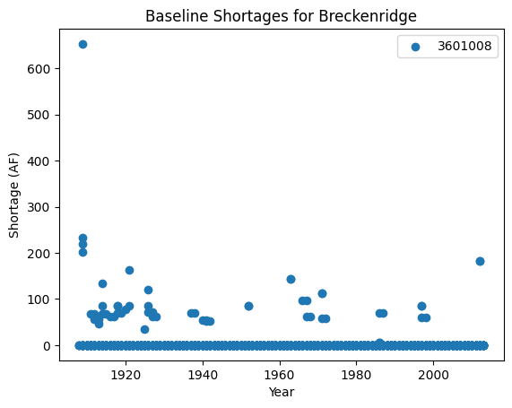
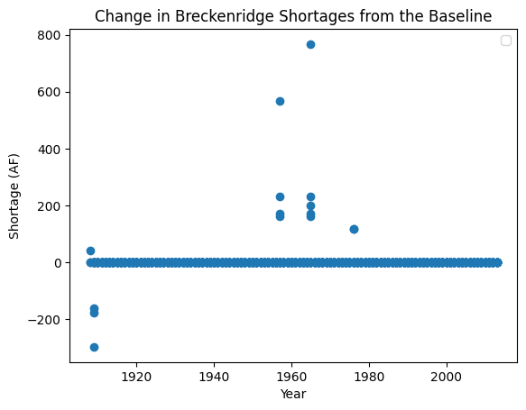

``statemodify`` Quickstarter Notebook #3 : Using the RES Modification Function in the Upper Colorado River Basin
----------------------------------------------------------------------------------------------------------------

This notebook demonstrates the reservoir storage modification function
in the Upper Colorado River Basin. In this notebook, we seek to
understand how changes to reservoir storage can impact user shortages.
First we run a baseline simulation, which runs the StateMod simulation
assuming that the current infrastructure has existed through the whole
simulation period. We next extract shortages for a municipality. Recall
that the list of users and their water rights can be found in the
``.ddr`` file (located: ``data/cm2015_StateMod/StateMod/cm2015.ddr``)

Step 1: Run a Historical Simulation in StateMod for the Uppper Colorado Subbasin
~~~~~~~~~~~~~~~~~~~~~~~~~~~~~~~~~~~~~~~~~~~~~~~~~~~~~~~~~~~~~~~~~~~~~~~~~~~~~~~~

.. code:: ipython3

    import argparse
    import logging
    import os
    import pickle
    from string import Template
    import subprocess
    
    import matplotlib.pyplot as plt
    import numpy as np
    import pandas as pd 
    import statemodify as stm

.. container:: alert alert-block alert-info

   NOTE: Each simulation in this notebook is run for the length of the
   historical period (from 1909-2013). If you want to reduce the length
   of the simulation, navigate to the ``.ctl`` file and adjust the
   ``iystr`` and ``iyend`` variables. For this notebook, this file is
   located in: ``data/cm2015_StateMod/StateMod/cm2015.ctl``

As before, we set the directories and associated paths and also run
StateMod in a baseline simulation.

.. code:: ipython3

    # statemod directory
    statemod_dir = "/usr/src/statemodify/statemod_upper_co"
    
    # root directory of statemod data for the target basin
    root_dir = os.path.join(statemod_dir, "src", "main", "fortran")
    
    # home directory of notebook instance
    home_dir = os.path.dirname(os.getcwd())
    
    # path to the statemod executable
    statemod_exe = os.path.join(root_dir, "statemod")
    
    # data directory and root name for the target basin
    data_dir = os.path.join(
        home_dir,
        "data",
        "cm2015_StateMod",
        "StateMod"
    )
    
    # directory to the target basin input files with root name for the basin
    basin_path = os.path.join(data_dir, "cm2015B")
    
    # scenarios output directory
    scenarios_dir_res = os.path.join(data_dir, "scenarios_res")
    
    # parquet files output directory
    parquet_dir_res = os.path.join(data_dir, "parquet_res")
    
    
    # path to res template file
    res_template_file = os.path.join(
        home_dir,
        "data",
        "cm2015B_template_res.rsp"
    )

.. container:: alert alert-block alert-info

   NOTE In order to expedite simulations for the Upper Colorado dataset,
   make sure to turn off “Reoperation” mode. You can do so by opening
   ``/home/jovyan/data/cm2015_StateMod/StateMod/cm2015.ctl``, navigating
   to the ``ireopx`` entry and changing the value from “0” to “10”.

.. code:: ipython3

    # Change directories first 
    os.chdir(data_dir) #This is needed specific to the Upper Colorado model as the path name is too long for the model to accept
    subprocess.call([statemod_exe, "cm2015B", "-simulate"])


.. parsed-literal::

      Parse; Command line argument: 
      cm2015B -simulate                                                                                                              
    ________________________________________________________________________
    
            StateMod                       
            State of Colorado - Water Supply Planning Model     
    
            Version: 15.00.01
            Last revision date: 2015/10/28
    
    ________________________________________________________________________
    
      Opening log file cm2015B.log                                                                                                                                                                                                                                                     
      
      Subroutine Execut
      Subroutine Datinp
    
    ...

   ________________________________________________________________________
      Execut; Successful Termination
      Statem; See detailed messages in file: cm2015B.log                                                                                                                                                                                                                                                     
     Stop 0


We isolate the shortages for one municipal user: the Town of Brekenridge
at the base of the Rocky Mountains’ Tenmile Range (ID: 3601008). If we
look up this user in the ``cm2015B.ddr`` file, we see that the user has
median water rights (47483.00000) and a smaller decree of 2.90 cfs.

.. code:: ipython3

    #Extract shortages using statemodify convert_xdd() function  
    
    # create a directory to store the historic shortages 
    output_dir = os.path.join(data_dir, "historic_shortages")
    
    # create a directory to store the new files in if it does not exist
    output_directory = os.path.join(data_dir, "historic_shortages")
    if not os.path.exists(output_directory):
        os.makedirs(output_directory)
    
    stm.xdd.convert_xdd(
        # path to a directory where output .parquet files should be written
        output_path=output_dir,
        # whether to abort if .parquet files already exist at the output_path
        allow_overwrite=True,
        # path, glob, or a list of paths/globs to the .xdd files you want to convert
        xdd_files=os.path.join(data_dir, "*.xdd"),
        # if the output .parquet files should only contain a subset of structure ids, list them here; None for all
        id_subset=['3601008'],
        # how many .xdd files to convert in parallel; optimally you will want 2-4 CPUs per parallel process
        parallel_jobs=2,
        # convert to natural data types
        preserve_string_dtype=False
        
    )


.. parsed-literal::

    100%|██████████| 1/1 [00:00<00:00, 17.73it/s]


Next we plot the shortages for Breckenridge.

.. code:: ipython3

    data=pd.read_parquet(output_dir +'/cm2015B.parquet',engine='pyarrow')
    
    fig, ax = plt.subplots()
    
    for name, group in data.groupby('structure_id'):
        ax.scatter(
            group['year'], group['shortage_total'], label=name)
    
    plt.xlabel("Year")
    plt.ylabel("Shortage (AF)")
    plt.title("Baseline Shortages for Breckenridge")
    plt.legend()


.. parsed-literal::

    <matplotlib.legend.Legend at 0x7f44455974f0>





We see that Breckenridge has experienced a variety of shortages
throughout the baseline simulation period.

Step 2: Modify StateMod Input Files for Exploratory Analyses- Reservoir Function Example
~~~~~~~~~~~~~~~~~~~~~~~~~~~~~~~~~~~~~~~~~~~~~~~~~~~~~~~~~~~~~~~~~~~~~~~~~~~~~~~~~~~~~~~~

If we look at the ``cm2015B.res`` file (learn more about the
```.res`` <https://opencdss.state.co.us/statemod/latest/doc-user/InputDescription/411/>`__\ file),
we see that Breckenridge has an account in the Clinton Gulch Reservoir,
but a quick look in the
```.opr`` <https://opencdss.state.co.us/statemod/latest/doc-user/InputDescription/413/>`__
file also indicates that Breckenridge can receive water from the Dillon
reservoir. Let’s investigate what happens to these shortages when
storage at these two basins decreases using the ``modify_res()``
function. As done in Hadjimichael et al. (2020), we sample losses using
a Latin hypercube sampling of up to 20% of the capacity of the
reservoirs (informed by Graf et al. (2010)) which may be due to erosion
and sedimentation of reservoirs in the UCRB, resulting in reduced
storage. The accounts associated with the reservoirs are also reduced
equally in order to accommodate the new storage level. For this example,
we want to change the reservoir storage for a specific set of reservoirs
by specifying the reservoir IDs for the ``target_structure_id_list``.
However, by setting ``target_structure_id_list=None`` we can decrease
storage at all reservoirs in the basin.

.. code:: ipython3

    output_directory = output_dir = os.path.join(data_dir, "input_files")
    scenario = "1"
    # basin name to process
    basin_name = "Upper_Colorado"
    
    # seed value for reproducibility if so desired
    seed_value = 1
    
    # number of jobs to launch in parallel; -1 is all but 1 processor used
    n_jobs = 2
    
    # number of samples to generate
    n_samples = 1
    
    stm.modify_res(output_dir=output_directory,
                   scenario=scenario,
                   basin_name=basin_name,
                   target_structure_id_list=['3603575','3604512'],
                   seed_value=seed_value,
                   n_jobs=n_jobs,
                   n_samples=n_samples,
                   save_sample=True)


Since we are sampling only reductions in storage, we can investigate
behavior with a single sample. We can then load the saved sample to see
the percent reduction in reservoir storage volume that has been applied
to the different reservoirs. The sample indicates that we are reducing
the reservoir storage volume to 86% of the original storage.

.. code:: ipython3

    import numpy as np
    sample_array = np.load(output_directory+'/res_1-samples_scenario-1.npy')
    sample_array


.. parsed-literal::

    array([0.86911215])


Step 3: Read in the New Input Files and Run StateMod : Reservoir Example
~~~~~~~~~~~~~~~~~~~~~~~~~~~~~~~~~~~~~~~~~~~~~~~~~~~~~~~~~~~~~~~~~~~~~~~~

Now that we have created the input files, the next step is to run
StateMod with the new input files. We create a template ``.rsp`` file
(``cm2015B_template_res.rsp``) and swap in the path to the alternative
``.res`` files that are created. Then we run StateMod for the two
scenarios and extract the shortages for Breckenridge.

.. code:: ipython3

    # set realization and sample
    realization = 1
    sample = np.arange(0, 2, 1)
    
    # read RSP template
    with open(res_template_file) as template_obj:
        
        # read in file
        template_rsp = Template(template_obj.read())
    
        for i in sample:
            
            # create scenario name
            scenario = f"S{i}_{realization}"
            
            # dictionary holding search keys and replacement values to update the template file
            d = {"RES": f"../../input_files/cm2015B_{scenario}.res"}
            
            # update the template
            new_rsp = template_rsp.safe_substitute(d)
            
            # construct simulated scenario directory
            simulated_scenario_dir = os.path.join(scenarios_dir_res, scenario)
            if not os.path.exists(simulated_scenario_dir):
                os.makedirs(simulated_scenario_dir)
                
            # target rsp file
            rsp_file = os.path.join(simulated_scenario_dir, f"cm2015B_{scenario}.rsp")
            
            # write updated rsp file
            with open(rsp_file, "w") as f1:
                f1.write(new_rsp)
            
            # construct simulated basin path
            simulated_basin_path = f"cm2015B_{scenario}"
    
            # run StateMod
            print(f"Running: {scenario}")
            os.chdir(simulated_scenario_dir)
    
            subprocess.call([statemod_exe, simulated_basin_path, "-simulate"])
            
            #Save output to parquet files 
            print('creating parquet for ' + scenario)
            
            output_directory = os.path.join(parquet_dir_res+"/scenario/"+ scenario)
            
            if not os.path.exists(output_directory):
                os.makedirs(output_directory)
            
            stm.xdd.convert_xdd(
                output_path=output_directory,
                allow_overwrite=True,
                xdd_files=scenarios_dir_res + "/"+ scenario + "/cm2015B_"+scenario+".xdd",
                id_subset=['3601008'],
                parallel_jobs=2,
                preserve_string_dtype=False
            )


.. parsed-literal::

    Running: S0_1
      Parse; Command line argument: 
      cm2015B_S0_1 -simulate                                                                                                         
    ________________________________________________________________________
    
            StateMod                       
            State of Colorado - Water Supply Planning Model     
    
            Version: 15.00.01
            Last revision date: 2015/10/28
    
    ________________________________________________________________________
    
      Opening log file cm2015B_S0_1.log                                                                                                                                                                                                                                                
      
      Subroutine Execut
      Subroutine Datinp
    
    ...

    ________________________________________________________________________
      Execut; Successful Termination
      Statem; See detailed messages in file: cm2015B_S0_1.log                                                                                                                                                                                                                                                
     Stop 0
    creating parquet for S0_1


.. parsed-literal::

    100%|██████████| 1/1 [00:00<00:00, 586.29it/s]


.. parsed-literal::

    Running: S1_1
      Parse; Command line argument: 
      cm2015B_S1_1 -simulate                                                                                                         
    ________________________________________________________________________
    
            StateMod                       
            State of Colorado - Water Supply Planning Model     
    
            Version: 15.00.01
            Last revision date: 2015/10/28
    
    ________________________________________________________________________
    
      Opening log file cm2015B_S1_1.log                                                                                                                                                                                                                                                
      
      Subroutine Execut
      Subroutine Datinp
    
    ________________________________________________________________________
      Datinp; Control File (*.ctl) 
    
    ________________________________________________________________________
      Datinp; River Network File (*.rin)
    
    ________________________________________________________________________
      Datinp; Reservoir Station File (*.res)
    
    ________________________________________________________________________
      GetFile;  Stopped in GetFile, see the log file (*.log)
     Stop 1
    creating parquet for S1_1


.. parsed-literal::

    100%|██████████| 1/1 [00:00<00:00, 589.42it/s]


Here, we extract the shortages from the Parquet files for the baseline
and alternative states of the world and plot the resulting shortages.

.. code:: ipython3

    baseline=pd.read_parquet(data_dir+'/'+'historic_shortages/cm2015B.parquet',engine='pyarrow')
    SOW_1=pd.read_parquet(parquet_dir_res+'/scenario/S0_1/cm2015B_S0_1.parquet',engine='pyarrow')


.. code:: ipython3

    baseline["shortage_total"]


.. parsed-literal::

    283920      0.
    283921      0.
    283922      0.
    283923    220.
    283924    201.
              ... 
    285280      0.
    285281      0.
    285282      0.
    285283      0.
    285284      0.
    Name: shortage_total, Length: 1365, dtype: object


.. code:: ipython3

    baseline=pd.read_parquet(data_dir+'/'+'historic_shortages/cm2015B.parquet',engine='pyarrow')
    SOW_1=pd.read_parquet(parquet_dir_res+'/scenario/S0_1/cm2015B_S0_1.parquet',engine='pyarrow')
    
    #Subtract shortages with respect to the baseline
    subset_df=pd.concat([baseline['year'],baseline['shortage_total'],SOW_1['shortage_total']],axis=1)
    subset_df = subset_df.set_axis(['Year', 'Baseline', 'SOW_1'], axis=1)
    subset_df['SOW_1_diff']=subset_df['SOW_1']-subset_df['Baseline']
    
    #Plot shortages
    fig, ax = plt.subplots()
    
    ax.scatter(subset_df['Year'], subset_df['SOW_1_diff'])
    
    plt.xlabel("Year")
    plt.ylabel("Shortage (AF)")
    plt.title("Change in Breckenridge Shortages from the Baseline")
    plt.legend()


.. parsed-literal::

    No artists with labels found to put in legend.  Note that artists whose label start with an underscore are ignored when legend() is called with no argument.


.. parsed-literal::

    <matplotlib.legend.Legend at 0x7f4434f250f0>





When we plot the shortages to Breckenridge under the alternative SOW
where reservoir storage is reduced across the two reservoirs, we can see
that there are now instances in which Breckenridge experiences larger
shortages than in the baseline case. Given that the town utilizes both
direct diversions and reservoir storage for water supply, this result
suggests that they have less of a bank of water to pull from in the two
reservoirs which increases shortages. However, there are even some cases
where the town experiences surpluses and many cases where the shortages
do not change, demonstrating that there is inherent complexity in the
mapping of reservoir level to shortages, especially when the user has
multiple reservoir accounts.

Now continue on to Quickstarter Notebook #4 to learn about running
StateMod with new streamflow scenarios across the West Slope basins.

Notebook References
~~~~~~~~~~~~~~~~~~~

Graf, W. L., Wohl, E., Sinha, T., & Sabo, J. L. (2010). Sedimentation
and sustainability of western American reservoirs. Water Resources
Research, 46, W12535. https://doi.org/10.1029/2009WR008836

Hadjimichael, A., Quinn, J., Wilson, E., Reed, P., Basdekas, L., Yates,
D., & Garrison, M. (2020). Defining robustness, vulnerabilities, and
consequential scenarios for diverse stakeholder interests in
institutionally complex river basins. Earth’s Future, 8(7),
e2020EF001503.

.. container:: alert alert-block alert-warning

   Tip: If you are interested in understanding how to apply
   ``statemodify`` functions to your own model, take a look at the
   source code found in the repository here:

   .. container::

      ::

         1.  <a href="https://github.com/IMMM-SFA/statemodify/blob/main/statemodify/res.py">modify_res()</a>

