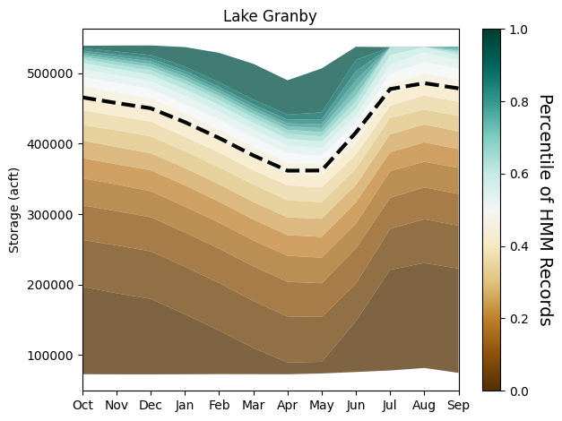
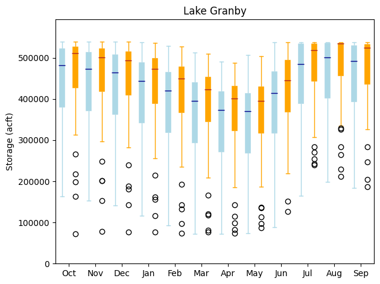

``statemodify`` Quickstarter Notebook #4: Using External Methods to Generate Synthetic Streamflow Traces
--------------------------------------------------------------------------------------------------------

In this notebook, we will demonstrate Option 2 that is provided by
``statemodify``, which is the ability to create future states of the
world through external methods rather than manipulating the baseline
time series as we do in Option 1. Here we offer a method to generate
alternative streamflow time series for the five West Slope basins using
the ``modify_xbm_iwr()`` function.

The Colorado River Basin (CRB) is experiencing a shift to a more arid
climate which will likely be characterized by droughts that are longer
and more severe than what has been experienced historically. The
historic streamflow record is now not a sufficient representation of
future hydroclimate. Thus, we need methods of creating plausible future
streamflow scenarios for the region that can plausibly expand this
historic record.

In this notebook, we demonstrate how to use the multi-site Hidden Markov
model (HMM)-based synthetic streamflow generator in ``statemodify`` to
create ensembles of plausible future regional streamflow traces for our
five West Slope basins. The HMM is fit to log annual historical
streamflow across the outlet gauges of five key basins on the West Slope
of the state of Colorado that drain into the Colorado River. The model
can then be used to generate streamflow scenarios that envelope the
historical record and expand the representation of natural variability
in the hydroclimate while still preserving the inter-site correlations
across the outlet gauges and at sites within each of the five basins.
The HMM-based model is particularly useful for generating sequences of
streamflow that exhibit long persistence, including decadal to
multidecadal hydrological drought conditions that are scarcely
represented within the historical records.

By fitting the HMM on the historical time series of the basins, we
create synthetic traces that are stationary and thus give an indication
of the extent of natural variability that characterizes the region. The
HMM can be extended to create non-stationary traces, as shown in
Hadjimichael et al. (2020), but that version of the model is not
currently included in ``statemodify``.

.. container:: alert alert-block alert-info

   NOTE: Each simulation in this notebook is run for the length of the
   historical period (from 1909-2013). If you want to reduce the length
   of the simulation, navigate to the ``.ctl`` file and adjust the
   ``iystr`` and ``iyend`` variables. For this notebook, this file is
   located in: ``data/cm2015_StateMod/StateMod/cm2015.ctl``

Step 1: Fit Multi-Site HMM
~~~~~~~~~~~~~~~~~~~~~~~~~~

.. code:: ipython3

    import argparse
    import logging
    import os
    import pickle
    from string import Template
    import subprocess

    import matplotlib.pyplot as plt
    import numpy as np
    import pandas as pd
    import statemodify as stm

First we define directories and associated paths.

.. code:: ipython3

    # statemod directory
    statemod_dir = "/usr/src/statemodify/statemod_upper_co"

    # root directory of statemod data for the target basin
    root_dir = os.path.join(statemod_dir, "src", "main", "fortran")

    # home directory of notebook instance
    home_dir = os.path.dirname(os.getcwd())

    # path to the statemod executable
    statemod_exe = os.path.join(root_dir, "statemod")

    # data directory and root name for the target basin
    data_dir = os.path.join(
        home_dir,
        "data",
        "cm2015_StateMod",
        "StateMod"
    )

    # directory to the target basin input files with root name for the basin
    basin_path = os.path.join(data_dir, "cm2015B")

    # scenarios output directory
    scenarios_dir = os.path.join(data_dir, "scenarios")

    # path to iwr/xbm file
    xbm_iwr_template_file = os.path.join(
        home_dir,
        "data",
        "cm2015B_template_xbm_iwr.rsp"
    )

We create a function ``hmm_multisite_fit()`` that houses the Python code
to fit the multi-site HMM to annual flow at the outlet gauges of the
five basins. In this function, you can specify the output directory to
store the HMM parameters.

.. code:: ipython3

    #Make directory to store HMM parameters

    output_dir = os.path.join(data_dir, "HMM_parameters")

    if not os.path.exists(output_dir):
        os.makedirs(output_dir)

    n_basins = 5

    # choice to save parameters to NumPy array files
    save_parameters = True

    fit_array_dict = stm.hmm_multisite_fit(n_basins=n_basins,
                                           save_parameters=save_parameters,
                                           output_directory=output_dir)

    # unpack output dictionary
    unconditional_dry = fit_array_dict["unconditional_dry"]
    unconditional_wet = fit_array_dict["unconditional_wet"]
    logAnnualQ_h = fit_array_dict["logAnnualQ_h"]
    transition_matrix = fit_array_dict["transition_matrix"]
    covariance_matrix_wet = fit_array_dict["covariance_matrix_wet"]
    covariance_matrix_dry = fit_array_dict["covariance_matrix_dry"]
    wet_state_means = fit_array_dict["wet_state_means"]
    dry_state_means = fit_array_dict["dry_state_means"]


Step 2: Sample from multi-site HMM
~~~~~~~~~~~~~~~~~~~~~~~~~~~~~~~~~~

We then use the ``hmm_multisite_sample()`` function to sample from the
HMM 100 times to develop 100 alternative, 105-year traces of streamflow
at the outlet gauge of each basin and we save each trace in a .csv file
in the ``HMM_Runs`` folder.

.. code:: ipython3

    #Create a folder to store the runs

    output_dir = os.path.join(data_dir, "HMM_Runs")

    if not os.path.exists(output_dir):
        os.makedirs(output_dir)

    # using the outputs of the fit function above; this function write output sample files to the output directory
    stm.hmm_multisite_sample(logAnnualQ_h,
                             transition_matrix,
                             unconditional_dry,
                             dry_state_means,
                             wet_state_means,
                             covariance_matrix_dry,
                             covariance_matrix_wet,
                             n_basins=n_basins,
                             output_directory=output_dir)

Then one can plot flow duration curves (FDCs) of the annual
synthetically generated flow at each basin compared to the the
historical record. We see that the HMM is enveloping the historical
record and also expanding it around it, particularly around the tails of
the distribution, which will lead to more instances of extreme flood and
drought events.

.. code:: ipython3

    stm.plot_flow_duration_curves(flow_realizations_directory=output_dir,
                                  save_figure=True,output_directory=output_dir,
                                  figure_name= 'FDC',
                                  dpi= 300)


.. image:: ../notebooks/output_15_0.png


Step 3: Modify StateMod Input Files for Exploratory Analyses- Streamflow Example
~~~~~~~~~~~~~~~~~~~~~~~~~~~~~~~~~~~~~~~~~~~~~~~~~~~~~~~~~~~~~~~~~~~~~~~~~~~~~~~~

In order for the HMM to be used in conjunction with StateMod, we utilize
a statistical disaggregation technique to disaggregate the synthetically
generated outlet gauge flow to the upstream nodes and also from an
annual to monthly time scale. The synthetic log-space annual flows are
converted to real space and temporally downscaled to monthly flows using
a modification of the proportional scaling method used by Nowak et
al. (2010). First, a historical year is probabilistically selected based
on its “nearness” to the synthetic flow at the last node in terms of
annual total. The shifted monthly flows at the last node are then
downscaled to all other nodes using the same ratios of monthly flows at
the upstream nodes to the last node as in the historically selected
year.Though not demonstrated in this notebook, the irrigation demands
(in the
```.iwr`` <https://opencdss.state.co.us/statemod/latest/doc-user/InputDescription/41/>`__
file) are also inherently tied to the generation of the streamflow, as
irrigation demands will increase in dry years. Thus, a regression is fit
across historical irrigation anomalies and historical annual flow
anomalies and the appropriate irrigation anomaly is determined from this
regression for every synthetically generated flow anomaly. More
information on this method can be found in Hadjimichael et al., 2020.
All of this functionality is embedded in the ``modify_xbm_iwr()``
function.

.. code:: ipython3

    #Make directory to store input files

    output_dir = os.path.join(data_dir, "input_files")

    if not os.path.exists(output_dir):
        os.makedirs(output_dir)


    flow_realizations_directory = os.path.join(data_dir, "HMM_Runs")

    scenario = "1"

    # basin name to process
    basin_name = "Upper_Colorado"

    # seed value for reproducibility if so desired
    seed_value = 123

    # number of jobs to launch in parallel; -1 is all but 1 processor used
    n_jobs = 2

    # number of samples to generate (how many new xbm and iwr files); produces an IWR multiplier
    n_samples = 1

    # generate a batch of files using generated LHS
    stm.modify_xbm_iwr(output_dir=output_dir,
                       flow_realizations_directory=flow_realizations_directory,
                       scenario=scenario,
                       basin_name=basin_name,
                       seed_value=seed_value,
                       n_jobs=n_jobs,
                       n_samples=n_samples,
                       save_sample=True,
                       randomly_select_flow_sample=True)

Step 4: Read in the New Input Files and Run StateMod : Streamflow Example
~~~~~~~~~~~~~~~~~~~~~~~~~~~~~~~~~~~~~~~~~~~~~~~~~~~~~~~~~~~~~~~~~~~~~~~~~

Now that we have created the new files, the next step is to run them
through StateMod. We create a template ``.rsp`` file
(``cm2015B_template_xbm_iwr.rsp``) and swap in the path to the
alternative
```.xbm`` <https://opencdss.state.co.us/statemod/latest/doc-user/OutputDescription/513/>`__
and ``.iwr`` files that are created. Then we run StateMod for the single
scenario and one can then go on and extract shortages or reservoir
levels.

.. container:: alert alert-block alert-info

   NOTE In order to expedite simulations for the Upper Colorado dataset,
   make sure to turn off “Reoperation” mode. You can do so by opening
   ``/home/jovyan/data/cm2015_StateMod/StateMod/cm2015.ctl``, navigating
   to the ``ireopx`` entry and changing the value from “0” to “10”.

.. code:: ipython3

    # set realization and sample
    realization = 1
    sample = np.arange(0, 1, 1)

    # read RSP template
    with open(xbm_iwr_template_file) as template_obj:

        # read in file
        template_rsp = Template(template_obj.read())

        for i in sample:

            # create scenario name
            scenario = f"S{i}_{realization}"

            # dictionary holding search keys and replacement values to update the template file
            d = {"XBM": f"../../input_files/cm2015B_{scenario}.xbm","IWR": f"../../input_files/cm2015B_{scenario}.iwr"}

            # update the template
            new_rsp = template_rsp.safe_substitute(d)

            # construct simulated scenario directory
            simulated_scenario_dir = os.path.join(scenarios_dir, scenario)
            if not os.path.exists(simulated_scenario_dir):
                os.makedirs(simulated_scenario_dir)

            # target rsp file
            rsp_file = os.path.join(simulated_scenario_dir, f"cm2015B_{scenario}.rsp")

            # write updated rsp file
            with open(rsp_file, "w") as f1:
                f1.write(new_rsp)

            # construct simulated basin path
            simulated_basin_path = f"cm2015B_{scenario}"

            # run StateMod
            print(f"Running: {scenario}")
            os.chdir(simulated_scenario_dir)

            subprocess.call([statemod_exe, simulated_basin_path, "-simulate"])


.. parsed-literal::

    Running: S0_1
      Parse; Command line argument:
      cm2015B_S0_1 -simulate
    ________________________________________________________________________

            StateMod
            State of Colorado - Water Supply Planning Model

            Version: 15.00.01
            Last revision date: 2015/10/28

    ________________________________________________________________________

      Opening log file cm2015B_S0_1.log

      Subroutine Execut
      Subroutine Datinp

    ...

 ________________________________________________________________________
      Execut; Successful Termination
      Statem; See detailed messages in file: cm2015B_S0_1.log
     Stop 0


It’s easiest to see the value of generating multiple streamflow
scenarios if we run 100-1000 scenarios through StateMod. However, this
container does not have the resources to support exploratory modeling at
this scale. So we run these simulations externally and below, we read in
the ``.xre`` files with the ``read_xre()`` helper function and show the
distribution of the reservoir levels that are observed across Lake
Granby in the Upper Colorado under the 100 simulated scenarios versus
the historical 105-year period.

.. code:: ipython3

    # Example with Granby Lake
    zip_file_path = os.path.join(home_dir, 'data', 'Granby_Dataset.zip')
    final_directory = os.path.join(home_dir, 'data/')

    !unzip $zip_file_path -d $final_directory
    granby_hmm, granby_hist, granby_hist_mean, granby_hist_1p = stm.read_xre(os.path.join(home_dir,"data/Upper_Colorado/"), 'Granby')

    # Plot quantiles
    stm.plot_res_quantiles(granby_hmm, granby_hist_mean, 'Lake Granby')





Here, we plot the monthly reservoir storage quantiles across each month
of the year. The shading corresponds to the larger 100-member sample
from the HMM and the dotted black line corresponds to the monthly
average storage across the historical 105-year record. Importantly, the
HMM is expanding the distribution of reservoir storages, particularly
creating both larger and smaller storages, meaning that we are capturing
reservoir levels under a broader range of wetter and drier conditions
that could have implications for shortages for users.

We can also plot the range of monthly storages from the HMM and
historical period as box plots for an alternative comparison using the
``plot_reservoir_boxes()`` helper function.

.. code:: ipython3

    # using the output of the above `read_xre` function as inputs
    stm.plot_reservoir_boxes(granby_hmm, granby_hist, 'Lake Granby')





Here, the blue box plots correspond to the HMM-generated reservoir
storages and the orange box plots correspond to the historical monthly
dataset. The black circles represent outliers. As illustrated in the
quantile plot above as well, for all months, the HMM is creating a wider
distribution of reservoir storages, and tends to be able to encompass
even historical outliers. Remember that the HMM has only been fit on the
historical dataset. Thus, the HMM can provide an estimate of the expanse
of reservoir storages that can be expected just within the range of
natural variability, which is quite large! Particularly, the HMM is
creating many more instances of drier scenarios and lower reservoir
levels which can be very useful for informing drought vulnerability
assessments.

.. container:: alert alert-block alert-info

   NOTE: If you are curious to learn more about HMM-based synthetic
   streamflow generation, including model fitting, validation, and
   applications, please refer to the following resources:

   .. container::

      ::

         1.  <a href="https://waterprogramming.wordpress.com/2018/07/03/fitting-hidden-markov-models-part-i-background-and-methods/">Fitting Hidden Markov Models: Background and Methods</a>

   .. container::

      ::

          2.  <a href="https://waterprogramming.wordpress.com/2018/07/03/fitting-hidden-markov-models-part-ii-sample-python-script/">Fitting Hidden Markov Models: Sample Scripts</a>

   .. container::

      ::

          3. <a href="https://uc-ebook.org/docs/html/A2_Jupyter_Notebooks.html#a-hidden-markov-modeling-approach-to-creating-synthetic-streamflow-scenarios-tutorial">A Hidden-Markov Modeling Approach to Creating Synthetic Streamflow Scenarios Tutorial</a>

Notebook Specific References
~~~~~~~~~~~~~~~~~~~~~~~~~~~~

Nowak, K., Prairie, J., Rajagopalan, B., & Lall, U. (2010). A
nonparametric stochastic approach for multisite disaggregation of annual
to daily streamflow. Water resources research, 46(8).

Hadjimichael, A., Quinn, J., Wilson, E., Reed, P., Basdekas, L., Yates,
D., & Garrison, M. (2020). Defining robustness, vulnerabilities, and
consequential scenarios for diverse stakeholder interests in
institutionally complex river basins. Earth’s Future, 8(7),
e2020EF001503.

.. container:: alert alert-block alert-warning

   Tip: If you are interested in understanding how to apply
   ``statemodify`` functions to your own model, take a look at the
   source code found in the repository here:

   .. container::

      ::

         1.  <a href="https://github.com/IMMM-SFA/statemodify/blob/main/statemodify/xbm_iwr.py">modify_xbm_iwr()</a>
