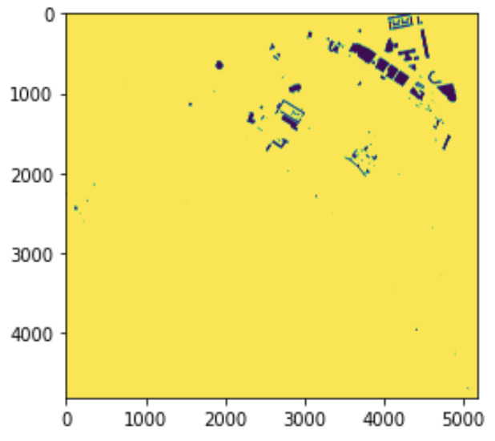

# Summary
I can cite these papers in my summary [@alova2020global; @craig2018review; @sridharan2019resilience; @JAYADEV2020114267; @khan2021impacts].  I can also cite this one [@eia2021lcoe].

We present the `statemodify` Python package... [Figure 1].

# Statement of Need
You really need `statemodify` because of something that was published in @vernon2018cerf and other reasons.  

# Design and Functionality
We have a quickstarter and some documentation here for you [documentation](https://immm-sfa.github.io/statemodify/).

# Acknowledgements
This research was supported by the U.S. Department of Energy, Office of Science, as part of research in MultiSector Dynamics, Earth and Environmental System Modeling Program.

# References
